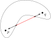

# Material und Methoden {#00b_material_and_methods}

In diesem Kapitel werden die theoretischen und praktischen Hintergründe der Arbeit dargestellt.

## Theoretische Hintergründe

Zu den wesentlichen theoretischen Hintergründen zählen:

### Literarische Programmierung

Die Arbeit ist in Donald Knuths Stil des literarischen Programmierens (bzw. *literate Programming*) verfasst. @literate_programming
Dabei steht nicht der Code im Zentrum, sondern die prosaische Beschreibung der Intention und der narrativen Entwicklung des Vorgehens.

Dies hat den Grund, dass Code häufiger gelesen als geschrieben wird und eine verständliche Beschreibung daher ebenso wichtig ist, wie der Code selbst.

Bei der literarischen Programmierung gibt es die beiden Operationen "*tangle*" und "*weave*", die auf den Projektquellen ausgeführt werden können.
Beim **Tanglen**, wird aus dem Projekt Quelltext generiert, der ausgeführt oder kompiliert werden kann, während beim **Weaven** die menschenlesbare Projektdokumentation generiert wird.

Die wesentlichen Aspekte des Literate Programming kommen bei der [Implementation](#03_implementation) des Aligners zur Anwendung, aber auch die restlichen Teile der Arbeit versuchen, die dargestellten Gedanken zu motivieren und mögliche Fragen vorwegzunehmen.

Extensive Beispiele, Informationen und sonstige Anmerkungen, die keine direkte Relevanz für die Forschungsfrage haben, aber z. B. dem besseren Veranschaulichung des Sachverhalts dienen, sind in farbig codierten Boxen untergebracht und können ggf. übersprungen werden.

### Optimierungsprobleme {#1_2_optimization}

Bei Optimierungsproblemen wird versucht, eine optimale Lösung für einen Sachverhalt zu finden.
Dazu wird eine Funktion $f: D \to \mathbb{R}$ aufgestellt, welche den "Wert" der zu betrachtenden Prozesse widerspiegelt und für diese einen Eingabewert $x^* \in D$ zu finden, der den maximalen Funktionswert ergibt, sodass $\forall x \in D: f(x^*) \geq f(x)$.
Außerdem gibt es üblicherweise noch bestimmte Beschränkungen, denen die errechnete Lösung genügen muss.
Bspw. können bei der Belegungsplanung für ein Krankenhaus Betten nicht doppelt belegt werden.

Da wir uns mit *linearen* Optimierungsproblemen beschäftigen und nur lineare Funktionen betrachten, können wir das Problem mittels Matrix-Multiplikation formulieren.
Wir schreiben dafür $\max \{c^{\top}x: Ax \le b, x \le 0\}$.
Dabei entsprechen die Vektoren $c, x \in \mathbb{R}^{n}$ den Koeffizienten $c$ von bzw. den Eingaben $x$ in $f$, und bilden als $c^{\top}x$ die zu optimierende Funktion $f$ ab.
Die Matrix $A \in \mathbb{R}^{n \times m}$ stellen "Kostenkoeffizienten" dar, mit denen die Eingaben $x$ assoziiert sind und der Vektor $b \in \mathbb{R}^{m}$ entspricht einem zur Verfügung stehenden Budget.

:::{#formulating-ip}
Auf dieser Grundform aufbauend kann man andere Probleme ableiten, bei denen z. B. der Wertebereich bestimmter Variablen eingeschränkt wird.
Das Vorgehen beim Aufstellen eines Optimierungsproblems ist üblicherweise dreigliedrig.

1. Die relevanten Variablen identifizieren,
2. Beschränkungen der Lösungsdomäne modellieren und
3. eine geeignete Zielfunktion formulieren.
:::

### Notation {#1_2_structures_and_notation}

Diese Sektion gibt Auskunft über die Bedeutung in der Arbeit genutzter Symbole und Notationen.

**Wahrheitswerte** werden mit $0$, für "falsch" und $1$, für "wahr" codiert und wir definieren $\mathbb{B} = \{0, 1\}$.

**Indexmengen** werden als $J_n$ geschrieben, mit $n \in \mathbb{N}$ und $J_n = \{1, 2, \dots, n\}$, sodass $|J_n| = n$.
Als Kurzschreibweise für die Menge $J_{|M|}$, die eine andere Menge $M$ indiziert, schreiben wir $J_M$.

**Prädikatabbildung** für $p$ wird mit Iverson-Klammern als $[p]$ notiert.

$$
[p] = \begin{cases}
    1, & p \text{ ist wahr} \\
    0, & p \text{ ist falsch} \\
\end{cases}
$$

Die Iverson-Notation wird nur in Summen-Termen genutzt und erlaubt die simple Darstellung von Index-Auswahlen.

#### Sequenzen {#1_2_1_sequences}

Sei eine Sequenz $s$ eine endliche Folge der Länge $M$ von Symbolen über einem bestimmten Alphabet $\Sigma$.

$$
\label{sequence-definition}
(s_i)_{i \in J_M}, \text{mit } M \in \mathbb{N}
\qquad
s_i \in \Sigma
$$

**Sequenzlängen**, also die Anzahl der Symbole einer Sequenz $s$, werden durch Betragsstriche notiert $|s|$.

Die **Sequenznummer** der $m$-ten Sequenz $s^m$ in einer Familie von $n$ Sequenzen $s^1, \dots, s^n$ wird durch einen hochgestellten Index ausgedrückt.
*Hochgestellte Indizes* bei anderen Variablen deuten *immer* auf einen *Zusammenhang mit* einer bestimmten *Sequenz* hin.

Die **Indizierung** von Sequenzen, also Wahl des $i$-ten Symbols in Sequenz $s$ wird mittels tiefgestellter Indizes als $s_i$ notiert.
Dies ist nur definiert, für $i \in J_s$.
*Tiefgestellte Indizes* bei anderen Variablen deuten *häufig*, aber nicht immer, auf einen *Zusammenhang mit* einer bestimmten *Sequenzposition* hin.

::: {#seq_examples}
:::: example

::::: {#seq_example}
Sei bspw. $s^\text{bsp} = \text{GATTACA}$ eine Nukleotidsequenz über dem Alphabet $\Sigma = \{A, C, G, T\}$, bestehend aus den Nukleobasen der DNA.
:::::

::::: {#seq_len_example}
Die Länge von $s^\text{bsp}$ ist durch $|s^\text{bsp}| = 7$ gegeben.
:::::

::::: {#seq_indexing_example}
Wenn wir referenzieren Position $i$ in $s^\text{bsp}$ als $s^\text{bsp}$.
Also $s^\text{bsp}_{3} = s^\text{bsp}_{4} = T$ und $s^\text{bsp}_{7} = A$.
Weiterhin sind $s^\text{bsp}_0$ und $s^\text{bsp}_8$ undefiniert, da die Indizes die Grenzen von $s$ überschreiten.
:::::
::::
:::

#### Matrizen {#1_2_2_matrices}

Eine Matrix $A = (a_{ij})$ kann mithilfe einer Befüllungsregel für ihre Elemente $a_{ij}$ definiert werden.
Bspw. $A = (a_{ij})$ mit $a_{ij} = 2 (i+j)$.

### Biologischer Hintergrund {#1_3_biology}

Bevor das Problem aufgestellt werden kann, wird zunächst der biologische Hintergrund betrachtet.

Zweck der Sequenzanalyse ist es, die Verwandtschaftsbeziehung der betrachteten biologischen Sequenzen abzuschätzen, also welche evolutionären Events zwischen ihnen liegen bzw. durch welche Mutationen sie sich auseinanderentwickelt haben.

Zwei wichtige Klassen von Mutationen in DNA sind Einzelnukleotid-Polymorphismen (**SNPs** oder "Substitutionen") und Insertionen bzw. Deletion (**Indels**).
Ein geeignetes Modell biologischer Verwandtschaft, muss diese Mutationen abbilden können.

Verwandtschaft zwischen Organismen lässt sich i.d.R. nicht direkt messen.
Stattdessen kann deren aus biologischen Sequenzen bestehendes Erbgut verglichen werden.
Dadurch entsteht ein Abbild des evolutionären Ist-Zustandes, welches wir nutzen um die Ähnlichkeit der genetischen Informationen, als indirektes Maß für Verwandtschaft, zu bestimmen.

Damit diese Ähnlichkeit bestimmt werden kann, müssen die Sequenzen gegeneinander ausgerichtet, bzw. aliniert werden.
Dieser Vorgang ordnet die zusammengehörigen Symbole der Sequenzen einander zu.

Eine Analogie ist eine Tabelle, bei der verwandte Symbole in derselben Spalte eingetragen werden.
Diese Tabelle entspricht einem sog. Alignment und die Ähnlichkeit zwischen den Sequenzen ergibt sich durch Gemeinsamkeiten und Unterschiededer Spalten.

#### Arten von Alignments

Wenn zwei Sequenzen aliniert werden, spricht man von paarweisem Sequenzalignment (**PSA**) und bei mehr als zwei Sequenzen von einem multiplen Sequenzalignment (**MSA**).

Weiterhin werden *globale* und *lokale* Alignments unterschieden.
Ein globales Alignment zweier Sequenzen betrachtet die Gesamtheit der zu alinierenden Sequenzen, während bei einem lokalen Alignment ggf. nur Teilstücke beider Sequenzen gegeneinander ausgerichtet werden.

#### Substitutionen {#1_3_1_substitutions}

Bei Substitutionen wird ein einzelnes Symbol in einer Sequenz durch ein anderes ersetzt.
Wenn sich die Sequenzsymbole in einem Alignment voneinander unterscheiden, spricht man von einem **Mismatch**.
*Mismatches werden* von uns *als SNPs interpretiert*.

Um Ähnlichkeit zu berechnen, müssen die Kosten für die Substitution von einem Symbol durch ein anderes bestimmt sein.

Um solche Kosten zu formulieren, gibt es verschiedene gebräuchliche Ansätze.

##### Flache Substitutionskosten

Die einfachste Möglichkeit bestraft jede Substitution mit einem festen Wert.
ClustalW in Version 1.6[^clustalw1.6_mismatch_penalty] arbeitet mit einer festen Strafe für Mismatches. @clustalW

[^clustalw1.6_mismatch_penalty]: : In der [Dokumentation](http://www.clustal.org/download/clustalw_help.txt) von ClustalW 2.1 findet sich der folgende Text:

    > CLUSTALW(1.6). The previous system used by Clustal W, in which matches score  
    > 1.0 and mismatches score 0. All matches for IUB symbols also score 0.

Für die Sequenzen $s^1$ und $s^2$ und Kosten für einen Match $w_\text{match}$, bzw. einen Missmatch durch $w_\text{miss}$, schreiben wir verkürzend $w_{ij}$ für die Kosten, die durch eine Substitution zwischen $s^1_i$ und $s^2_j$ entstehen.

$$
\label{substitution-weight}
w_{ij} = \begin{cases}
    w_\text{match} & , s^1_i = s^2_j \\
    w_\text{miss} & , \text{Andernfalls.} \\
\end{cases}
$$

##### Substitutionsmatrizen {#subst_mat}

Ein differenzierterer Ansatz ist die Verwendung von Substitutionsmatrizen.

Diese haben jeweils eine Spalte und Zeile für jedes mögliche Sequenzsymbol.
Die Zellen enthalten die Substitutionskosten, die durch den Austausch von Symbolen entstehen.
Anhand von Zeilen- und Spaltenindex wird einfach abgelesen, für welchen Austausch der entsprechende Wert steht.

::: example
Bspw. hätte eine Substitutionsmatrix für Nukleotidsequenzen die folgende Form:

$$
W = \begin{array}{c|cccc}
     & A & C & G & T \\
    \hline
    A & w_{AA} & w_{AC} & w_{AG} & w_{AT} \\
    C & w_{CA} & w_{CC} & w_{CG} & w_{CT} \\
    G & w_{GA} & w_{GC} & w_{GG} & w_{GT} \\
    T & w_{TA} & w_{TC} & w_{TG} & w_{TT} \\
\end{array}
$$

:::

Sei $W$ eine Substitutionsmatrix, welche Werte für die Symbole $X$ und $Y$ enthält, dann steht $w_{XY}$ für die Kosten, um ein $X$ durch ein $Y$ zu ersetzen.

Analog zu (eq:substitution-weight) können die Kosten einer Substitution zwischen $s^1_i$ und $s^2_j$ verkürzt als $w_{ij}$ dargestellt werden.

$$
\label{substitution-weight-mat}
w_{ij} = w_{s^1_i s^2_j}
$$

Clustal in Version 2 arbeitet mit Substitutionsmatrizen. [@clustalWX2]
Gebräuchliche Matrizen für Substitutionen von Aminosäureresten bei Peptidsequenzen sind z.B. BLOSUM [@henikoff92] und PAM [@dayhoff78].

Es existieren auch komplexe Substitutionsmodelle, wie TN93 [@tn93] oder GTR [@yang94].
Diese definieren bestimmte Eigenschaften für Substitutionsmatrizen, um die biologischen Prozesse im Hintergrund anzunähern.
Auf Basis von real beobachteten Mutationen können mithilfe dieser Modelle geeignete Substitutionsmatrizen für spezifische Fragestellungen bestimmt werden.

#### Indels {#1_3_2_indels}

Der Begriff Indel ist ein Kunstwort, welches die Begriffe Insertion und Deletion verbindet.
Dabei wurden, im Falle einer Insertion, in einer Sequenz bestimmte Nukleotide hinzugefügt, bzw., bei einer Deletion, entfernt.
Alignments können dementsprechend Lücken enthalten.
Wenn einer Position im Alignment kein Sequenzsymbol zugewiesen wurde, spricht man von einem **Gap**.
*Gaps werden* von uns *als Indels interpretiert*.

Bei der Alinierung einer Query- und einer Referenzsequenz, deutet eine Lücke in der Query auf eine Deletion und eine Lücke in der Referenz auf eine Insertion hin.

Diese Lücken sind ein weiteres gebräuchliches Kriterium, um Ähnlichkeit zu bestimmen.
Auch hier gibt es verschiedene gebräuchliche Modelle, um die Kosten zu modellieren.

##### Gaps sind Mismatches

Im einfachsten Fall werden Gaps nicht gesondert behandelt, sondern als Mismatches gezählt.
Die Bewertung erfolgt dann anhand der für Substitutionen verwendeten Methode.

##### Flache Gapkosten

Wie bei den flachen Substitutionskosten werden Lücken in der Sequenz hier mit einem flachen Wert pro fehlendem Symbol bestraft.
Allerdings existieren in dieser Variante unterschiedliche Werte für Substitutionen und Indels.

##### Affine Gapkosten

Genauere Modelle für Gapkosten nutzen affine[^affine_linear] Funktionen zur Kostenbestimmung.
Dabei werden verschiedene Kosten für das Öffnen und das Verlängern eines Gaps angelegt.[^affine_open_extend]

[^affine_linear]: Affine Funktionen werden *in der Schulmathematik* als "linear" bezeichnet.
    Affin ist z. B. die Funktion $y = mx + b$.
[^affine_open_extend]: Kosten für Gaps der Länge $l$ ließen sich dann bspw. als $g = w_\text{extend} l + w_\text{open}$ darstellen.

::: info
Aufgrund biochemischer Zusammenhänge[^reading_frame] ist es relativ unwahrscheinlich, dass überhaupt eine Lücke entsteht.

[^reading_frame]: Drei aufeinanderfolgende Basen bilden ein Codon, welches eine Aminosäure für ein Protein codiert.
    Alle Indels mit Längenveränderung $d \not\equiv 0 \mod 3$ verschieben den Leserahmen für Codons und sind i. d. R. tödlich.

Wenn dies jedoch der Fall ist, unterscheidet sich die Größe der Wahrscheinlichkeit für Länge $10$ nicht stark von der Wahrscheinlichkeit für Länge $11$.
:::

##### Konkave Gapkosten

Noch genauere Modelle nutzen konkave Funktionen, um die Gapkosten zu berechnen.
Dabei nehmen die Kosten, um eine Lücke zu erweitern, mit steigender Länge der Lücke ab.

Bei sehr kurzen Indels ist der Unterschied, ob eine Base mehr oder weniger entfernt wurde, wichtiger als bei sehr langen Indels.

::: info
Eine konkave Funktion hat einen nicht konvexen Epigraphen.
Der Epigraph einer Funktion ist die Menge aller Punkte, die auf oder über dem Funktionsgraphen liegen.

Anschaulich gesprochen ist eine Menge dann konvex, wenn man von jedem Punkt in der Menge aus jeden anderen erreichen kann, ohne dabei die Menge zu verlassen.

{#convex_set width=45%}
\hfill
{#non-convex_set width=45%}

\captiontwothrice{
    Eine konvexe und eine nicht-konvexe Menge.
}{
    Konvexe Menge
}{
    Nicht-konvexe Menge
}

Ein simples Beispiel für eine konkave Funktion ist $f(x) = -x^2$.
:::

### Dynamische Programmierung

Der Begriff der dynamischen Programmierung wurde von Richard Bellman geprägt. [@bellman52]
Dieser zeigte, dass die Zielfunktion einer bestimmten Klasse von Optimierungsproblemen als Rekursionsformel dargestellt werden kann.

Diese Probleme haben **"optimale Substruktur"**.
D.h. die optimale Lösung des Gesamtproblems ist auf die optimale Lösung kleinerer Teilprobleme zurückführbar.

Diese Eigenschaft nutzt man bei dynamischen Programmiermethoden, um Probleme rekursiv zu lösen.
Ein bekanntes Beispiel ist die Suche nach dem kürzesten Pfad zwischen zwei Knoten in einem Graphen.

Um ein Problem mit optimaler Substruktur dynamisch zu lösen, wird es in diskrete Schritte aufgeteilt.
Man definiert dann *Zustandsvariablen*, welche die aktuelle Situation nach bestimmten Schritten beschreiben, *Kontrollvariablen*, die beschreiben welche Entscheidung für den nächsten Schritt getroffen werden sollte und eine *Wertfunktion*, welche den optimalen Wert beschreibt, der, gegeben bestimmte Zustandsvariablen, erreicht werden kann.
Die *Zielfunktion* stellt man dann als Rekursionsbeziehung zwischen der Wertfunktion für Schritt $t$ und Schritt $t-1$ dar.

#### Needleman-Wunsch {#nw_explanation}

Sequenzalinierung ist ein Problem mit optimaler Substruktur.
Der Algorithmus für globale Sequenzalinierung von Needleman und Wunsch (**NW**),[^nw] macht sich diese Tatsache zunutze um eine Rekursionsbeziehung zu formulieren, mithilfe derer das optimale Alignment produziert werden kann.

[^nw]: Ursprünglich entwickelt von wurde der Algorithmus von Needleman und Wunsch in [@nw70].
    David Sankoff ergänzte das Vorgehen in [@sankoff72] und Smith und Waterman erweiterten das Prinzip in [@sw81] für das Finden lokaler Alignments.

Gegeben zwei Sequenzen $s^1 = (s^1_1, \dots, s^1_m)$ und $s^2 = (s^2_1, \dots, s^2_n)$, wird deren optimales Alignment in irgendeiner Art und Weise vom optimalen Alignment der Subsequenzen $(s^1_1, \dots, s^1_{m-1})$ und $(s^2_1, \dots, s^2_{n-1})$ abhängen.

Das leere Alignment dient als Basisfall, der Symbol für Symbol erweitert wird.
Die Zustandsvariablen sind gegeben durch die Anzahl der Symbole aus $s^1$ bzw. $s^2$, die bisher aliniert wurden.

Um dem Alignment die Sequenzsymbole $s^1_i$ und $s^2_j$ hinzufügen, existieren drei Möglichkeiten.

1. Man baut  $s^1_i$ und $s^2_j$ als Match oder Mismatch ein.
2. Man baut $s^1_i$ und einen Gap anstatt $s^2_j$ ein.
3. Man baut $s^2_j$ und einen Gap anstatt $s^1_i$ ein.

Die optimale Wahl *für diesen Schritt* ergibt sich, durch den Vergleich der Werte aller drei Möglichkeiten.
Da Symbole nicht mehrfach verwendet werden können, sind sie nach dem Einbau "konsumiert".

Für das Alignment zweier Sequenzen $s^1$ und $s^2$ mit Längen $M$ und $N$ definiert man nun rekursiv eine Matrix $F$, bei der Element $f_{ij}$ den Wert des optimalen Alignments der Subsequenzen $(s^1_1, \dots, s^1_i)$ und $(s^2_1, \dots, s^2_j)$ darstellt.
Folglich ist $f_{MN}$ der Wert des optimalen *globalen* Alignments, da dieses beide Sequenzen auf voller Länge gegeneinander ausrichtet.

Für $s^1$ und $s^2$ sei $(f_{ij}) = F \in \mathbb{R}^{M+1 \times N+1}$.
Gegeben seien Kosten für Matches $w_\text{match}$, Missmatches $w_\text{miss}$ und Gaps $w_\text{gap}$, sei außerdem $w_{ij}$ wie in (eq:substitution-weight).

$F$ hat eine Zeile für jedes Symol in $s^1$ und eine Spalte für jedes Symbol in $s^2$ und zusätzlich eine nullte extra Zeile und nullte extra Spalte.

Die nullte Zeile und Spalte dienen als Rekursionsanker.

$$
\label{nw-recurrence-anchor}
f_{i0} = w_\text{gap} \cdot i \qquad
f_{0j} = w_\text{gap} \cdot j
$$

Für die restlichen Elemente gilt die folgende Rekursionsbeziehung:

$$
\label{nw-recurrence-relation}
f_{ij} = \max \begin{cases}
    f_{i-1, j-1} + w_{ij}      & , \text{entspricht Match oder Mismatch} \\
    f_{i-1, j} + w_\text{gap}  & , \text{entspricht Gap in } s^2_j \\
    f_{i, j-1} + w_\text{gap}  & , \text{entspricht Gap in } s^1_i \\
 \end{cases}
$$

::: {#nw_step_interpretation}
Die Ursprungsrichtung hat dabei eine klare Interpretation im Kontext der Sequenzalinierung.
Diagonale Schritte entsprechen Matches oder Mismatches, während horizontale und vertikale Schritte Gaps anzeigen.[^nw_origin_interpretation]
Daher ist es wichtig, dass man sich bei der Berechnung merkt, auf welchem Vorgängerwert $f_{ij}$ beruht.
:::

[^nw_origin_interpretation]: Zeilen- und Spaltenindizes sind mit den Sequenzsymbolen verknüpft.
    Bei diagonaler Bewegung erhöhen sich beide Sequenzindizes und es werden Symbole beider Sequenzen genutzt.
    Im Gegensatz dazu werden bei horizontaler bzw. vertikaler Bewegung nur Symbole einer Sequenz verbraucht.

Anhand des so enststehenden Pfades kann aus der befüllten Matrix das optimale Alignment rekonstruiert werden.
Dafür werden üblicherweise Pfeile eingezeichnet, welche auf die Vorgängerzelle[^nw_multiple_origins] zeigen.

[^nw_multiple_origins]: Falls mehrere Vorgänger denselben Wert liefern sind beide Alignments gleichwertig und wir können entweder alle Möglichkeiten behalten oder uns für eine bestimmte entscheiden.
    Die Entscheidung für eine von mehreren Möglichkeiten sollte deterministisch sein, um reproduzierbare Ergebnisse zu garantieren.

Jeder Schritt durch die Matrix entspricht einer Position im Alignment.
Aufgrund des Aufbaus der Matrix ist die Symbolanordnung gewahrt.
Alle Symbole werden genau einmal genutzt und jede Position im Alignment bekommt höchstens eine Symbolzuweisung.

### Funktionale Programmierung

Die funktionale Programmierung baut auf dem von Alonzo Church entwickelten[^lambda_calc] Lambda-Kalkül auf, welches, analog zur bekannteren Turing-Maschine, ein mathematisches Modell für den Begriff der Berechenbarkeit formuliert. [@church40]
Alan Turing, dessen Doktorvater Church war, zeigte die Äquivalenz beider Modelle. [@turing_lambda_equivalence]

In funktionalen Sprachen werden Funktionen deklariert, welche nicht nur miteinander verknüpft (komponiert) und aufeinander angewandt werden, sondern auch anderen Funktionen als Werte übergeben oder von diesen zurückgegeben werden.

Funktionen im Sinne der funktionalen Programmierung bilden Bäume von Ausdrücken.
Dies steht im Kontrast zu den Funktionen in der klassischen imperativen Programmierung, die sequentiell Anweisungen ausführen, um den Programmzustand zu ändern.

#### Haskell

In dieser Arbeit nutzen wir Haskell, um eine Lösung für das Sequenzalinierungsproblem zu implementieren.
Haskell ist eine **nicht strikte** und **pur-funktionale** Sprache mit **call-by-name** Semantik.

##### Pur-funktionale Sprachen

In "puren" funktionalen Sprachen sind Funktionen deterministisch, d. h. gleiche Eingaben produzieren immer gleiche Ausgaben und frei von Nebeneffekten, wie z. B. Änderungen an globalen Zuständen wie Variablen.

Funktionen in pur-funktionalen Sprachen verhalten sich also wie mathematische Funktionen, welche ihre Funktionsargumente deterministisch auf Funktionswerte abbilden.

Dies hat bestimmte praktische Konsequenzen für Haskell.

Alle Werte in Haskell sind Funktionen.
Bspw. ist der Wert `1` eine Funktion, welche keine Argumente nimmt und auf sich selbst abbildet.

Werte in Haskell sind immutabel.
Wenn ein Wert in einem bestimmten Kontext an einen Namen gebunden wurde, dann kann der Name in diesem Kontext nicht anderweitig belegt werden.

Sabry formalisiert den Begriff in [@sabry98] und definiert Sprachen als pur-funktional, wenn sie die folgenden Kriterien erfüllen:

> A language is purely functional if  
> (i) it includes every simply typed λ-calculus term, and  
> (ii) its call-by-name, call-by-need, and call-by-value implementations are equivalent (modulo
divergence and errors).

##### Nicht-strikte Auswertung

In einer nicht-strikten[^eager] funktionalen Sprache werden Ausdrücke nur dann ausgewertet, wenn sie zur Berechnung eines Ergebnisses notwendig sind.
Man spricht auch von *call-by-need* oder *lazy* Evaluierung.

[^eager]: Das Gegenstück ist die strikte Auswertung, welche auch als *eager* Evaluierung bezeichnet wird.

Dies ermöglicht den Umgang mit undefinierten Ausdrücken.
Der Wert einer rekursiven Funktion für eine Eingabe, bei der die Berechnung nicht terminiert, ist nicht definiert.

::: example
Als praktisches Beispiel betrachten wir den Umgang mit unendlich langen Listen.

Der Ausdruck `map (+1) [1..]` ($\mathrm{A}$) wendet die Nachfolgerfunktion[^succ_func_naturals] auf alle natürlichen Zahlen an.
Die resultierende Liste wäre unendlich lang und damit ist das Ergebnis dieser Berechnung nicht definiert.

[^succ_func_naturals]: Die Nachfolgerfunktion $S: \mathbb{N} \to \mathbb{N}$ bildet natürliche Zahlen auf ihren Nachfolger ab $S: n \mapsto n+1$.

Allerdings ist es möglich, mit `take 10 (map (+1) [1..])` ($\mathrm{B}$) die ersten 10 Einträge dieser Liste zu berechnen.
Da nur die Teile des Ausdrucks $\mathrm{A}$ ausgewertet werden, welche für die Berechnung von $\mathrm{B}$ notwendig sind, terminiert die Berechnung und der Ausdruck ist wohldefiniert.
:::

##### Call-by-name Semantik

In Sprachen mit **call-by-name** werden Funktionsargumente bei Übergabe nicht ausgewertet, sondern deren Definitionen im Funktionskontext substituiert.

Wenn das Argument mehrfach verwendet wird, muss es potentiell bei jedem Vorkommen neu berechnet werden.
Der GHC Compiler optimiert den Code zwar, um solche doppelten Berechnungen zu vermeiden, aber dies ist nicht durch Haskells Sprachsemantik garantiert.

::: example
Betrachten wir die Funktion `sumTwice`, welche die Summe einer übergebenen Liste berechnet und diese mit sich selbst addiert.

```haskell
sumTwice :: [Int] -> Int
sumTwice ns = nsum + nsum
  where
    nsum = sum ns
```

Nutzen wir nun den Ausdruck `map (+1) [1..20]` als Argument für `sumTwice`, dann wird folgendermaßen evaluiert:

1. Definition des Arguments einsetzen
    
        sumTwice (map (+1) [1..20]) = nsum + nsum
          where
            nsum = sum (map (+1) [1..20])
2. Definition von `nsum` einsetzen
    
        sumTwice (map (+1) [1..20])
          = (sum (map (+1) [1..20])) + (sum (map (+1) [1..20]))
:::

### Verifikation

Bei der Verifikation eines Programmes soll gezeigt werden, dass ein Programm seine Spezifikation[^func_specification] erfüllt.

[^func_specification]: Eine Spezifikation ist die formale Beschreibung der gültigen Eingaben, des zu erwartenden Ergebnisses und den mit diesen zusammenhängenden Invarianten.

#### Tests

Ein typischer Ansatz, um dies sicherzustellen, ist das Schreiben von Funktionstests.
Dabei werden anhand der Spezifikation Äquivalenzklassen von Ein- und Ausgaben gebildet, die sich ähnlich verhalten.
Die Gesamtheit der Äquivalenzklassen deckt nicht nur valide Eingaben und Ergebnisse, sondern auch die existierenden Randfälle und Fehlermodi ab.

::: example
Sei bspw. eine Funktion `double sqrt(double x)`{.java} definiert, welche einen `double`{.java} Wert als Eingabe nimmt und die Quadratwurzel dieses Werts als `double`{.java} zurückgibt.

Da der Rückgabewert `double`{.java} ist, sind die Ergebnisse beliebiger negativer Eingaben undefiniert und führen zu Fehlern.
Also bilden alle negativen Eingaben eine Äquivalenzklasse für diesen bestimmten Fehlermodus.

Aus diesem Grund können wir das Verhalten der Funktion in solchen Fällen genauso gut durch Testen der Eingabe `-1`, wie `-2` absichern.
:::

Das Problem mit diesem Ansatz ist, dass nicht mit Sicherheit gesagt werden kann, ob alle relevanten Äquivalenzklassen korrekt identifiziert wurden.
Diese Klassen zu identifizieren hat viel mit Kreativität und Intuition zu tun und ist nicht leicht überprüfbar oder reproduzierbar.

Weiterhin könnte jemand, der alle möglichen Fehlermodi eines Programms kennt und auch weiß, wie man diese erkennt, einfach ein korrektes Programm schreiben.[^tests_considered_unnecessary]

[^tests_considered_unnecessary]: Man könnte fast sagen, "wer gute Tests schreiben kann, braucht sie nicht".
    Das ist natürlich polemisch, aber enthält zumindest ein Körnchen Wahrheit.

#### Verifikation durch Beweis

Es ist nachvollziehbar, dass das Testen von Programmen alleine nicht ausreicht, um deren Korrektheit zu zeigen.

Ein alternatives Vorgehen für die Verifikation eines Programmes besteht darin, Aussagen über bestimmte Eigenschaften des Programmes mathematisch zu beweisen.

##### Begriffe

Klären wir zunächst ein paar wichtige Begriffe.

**Aussagen** sind Sätze, denen man (prinzipiell) einen Wahrheitswert zuordnen kann.
Ein Beispiel für eine Aussage ist "es hat heute geregnet", keine Aussage wiederum ist "dieser Satz ist falsch".

**Aussageformen** oder **Prädikate** sind Ausdrücke mit Variablen, die nach Einsetzen der Variablen zu Aussagen werden.
Die Formel $3 \cdot x = 9$, welche durch Setzen von $x = 3$ zu einer wahren und sonst einer falschen Aussage wird ist ein Beispiel für eine Aussageform.
 Die Begriffe Aussage und Aussageform werden häufig synonym genutzt.

**Junktoren** sind logische Operatoren, welche verschiedene (Teil-)Aussagen zu neuen Aussagen verbinden.
Das logische UND $p \land q$ stellt ein Beispiel für ein Junktor dar.

**Schlussregeln** erlauben es, Aussagen umzuformen und so andere Aussagen abzuleiten.
Schlussregeln werden notiert, indem die Vorbedingungen oberhalb eines Striches und die äquivalenten Folgerungen unterhalb dessen notiert werden.
Ein Beispiel für eine Schlussregel ist die Kontraposition.

$$
\begin{array}{rcr}
    p & \rightarrow & q  \\
    \hline
    \lnot q & \rightarrow & \lnot p
\end{array}
$$

##### Beweistechniken

Um Aussagen über Programme zu beweisen existieren, verschiedene gängige Beweistechniken.
Im Folgenden betrachten wir eine Auswahl solcher Verfahren.

###### Hoare-Kalkül

CAR Hoare entwickelte in 1969 @hoare ein Kalkül, um Aussagen *für imperative Programme* zu beweisen.
Da unsere Implementation nicht in einer imperativen Sprache geschrieben wurde, werden wir uns hier nur am Rande damit beschäftigen.

Im Hoare-Kalkül werden **Hoare-Tripel** der Form $\{P\}C\{Q\}$ betrachtet.
Bei $P$ und $Q$ handelt es sich um Zusicherungen und bei $C$ um einen Befehl.
Die Zusicherungen lassen sich als logische Aussagen betrachten und $P$ betrifft einen Zustand vor Ausführung von $C$ und $Q$ einen anschließenden Zustand.

Wenn das Hoare-Tripel korrekt ist, dann folgt aus $P$ nach Ausführung von $C$ die Aussage $Q$.
Hoare hat Axiome und Schlussregeln für imperative Sprachkonstrukte wie z. B. Zuweisungen, Schleifen etc. definiert, mit denen die Korrektheit von Hoare-Tripeln geprüft werden kann.

**Abgleich**

Haskell hat eine Syntax, die stark an klassisch mathematische Notation angelehnt ist.
Dies erlaubt es in vielen Fällen, die mathematische und die programmatische Definition einer Funktion einfach abzugleichen.

::: example
Sei beispielsweise $\mathrm{Col}: \mathbb{N} \to \mathbb{N}$ die Collatzfunktion.

$$
\mathrm{Col}(n) = \begin{cases}
    \frac{n}{2} & , n \text{ ist gerade} \\
    3n + 1      & , \text{Andernfalls.} \\
\end{cases}
$$

Sei weiterhin `col` die folgende Haskell-Implementation für $\mathrm{Col}$.

```haskell
col :: Int -> Int
col n
  | even n = div n 2
  | otherwise = 3 * n + 1
```

Wir sehen, dass die Bedingungen und die daraus folgenden Ergebnisse in den Funktionen identisch sind, woraus folgt, dass $\mathrm{Col}$ und `col` identisch sein müssen.[^col_int_vs_nat]

[^col_int_vs_nat]: Strenggenommen nimmt die Funktion `col` Eingaben vom Typ `Int`, also $\mathbb{Z}$ an.
    Sie wird für Eingaben in $\mathbb{Z} \setminus \mathbb{N}$ allerdings nicht terminieren, weswegen ihr Ergebnis in diesen Fällen auch nicht definiert ist.
    Weiterhin gilt für alle Werte $n \in \mathbb{N}$ dass $\mathrm{Col}(n) = \mathtt{col}(n)$.

:::

Wenn wir zeigen können, dass die Funktionen unseres Programms identisch zu denen unseres Modells definiert sind, dann haben wir gezeigt, dass unser Programm das Modell akkurat implementiert.

**Induktionsbeweise**

Mithilfe der (mathematischen) Induktion können Beweise von Aussagen für alle Elemente einer abzählbar unendlichen Menge[^countably_infinite] geführt werden.

[^countably_infinite]: Unendliche Mengen sind abzählbar, wenn eine Bijektion $f: M \to \mathbb{N}$ zwischen den Elementen der Menge und den natürlichen Zahlen existiert.

Dabei beweist man eine Aussage zunächst für einen Basisfall[^induction_anchor] und zeigt anschließend, dass aus der Annahme,[^induction_hypothesis] die Aussage gelte für einen beliebigen Wert, folgt, dass sie auch für den Nachfolger dieses Wertes gilt.[^induction_step]

[^induction_anchor]: Der sog. **Induktionsanker**.
[^induction_hypothesis]: Die sog. **Induktionshypothese**.
[^induction_step]: Der sog. **Induktionsschritt**.

Rekursion definiert Basisfälle als Rekursionsanker und führt Eingaben mithilfe von Rekursionsschritte auf diese Basisfälle zurück.
Wir sehen also, dass es einen engen Zusammenhang zwischen Induktion und Rekursion gibt.

Aus diesem Grund sollte es uns nicht verwundern, dass sich die induktive Beweistechnik auf beliebige rekursiv definierte Strukturen, so wie z.B. Listen oder Bäume, erweitern lässt, um zu zeigen, dass eine Aussage für alle Elemente der Struktur gilt.
Man spricht in diesen Fällen von **struktureller** oder  **noetherscher[^noether] Induktion**.

[^noether]: So benannt nach Emmy Noether, der ersten Frau in Deutschland mit Doktortitel in der Mathematik, ersten weiblichen Proffesorin in Deutschland und Schülerin von David Hilbert.
    Noether spezifizierte u.a. den Begriff der wohlfundierten Relation, welcher die theoretische Basis der Technik liefert.

Sei $M$ eine rekursiv definierte Menge, mit einer Menge von Schlussregeln zur Bildung von $M$, welche sowohl Basis-, als auch rekursive Fälle abdecken.
Diese Schlussregeln besitzen die folgende Form:[^mixed_case_recursion_rule]

$$
\underbrace{
    \begin{array}{ll}
        \\[1ex]
        Q(m)  \\
        \hline
        F(m) \in  M
    \end{array}
}_\text{Bildungsregeln für Basisfälle}
\qquad
\underbrace{
    \begin{array}{ll}
        \bigwedge_{i = 1}^n m_i \in M \\
        R(m_1, \dots, m_n) \\
        \hline
        G(m_1, \dots, m_n) \in  M
    \end{array}
}_\text{Bildungsregeln für rekursive Fälle}
$$

[^mixed_case_recursion_rule]: Strenggenommen sind auch Regeln für gemischt-rekursive Fälle mit $n$ Elementen in $M$ und $k$ beliebigen anderen Elementen möglich.
    Der Umgang mit diesen erfordert keine besondere Vorsicht.
    Das Schema für derartige Bildungsregeln sähe in etwa so aus:
    $\begin{array}{ll} \bigwedge_{i = 1}^n m_i \in M \\ R'(m_1, \dots, m_n, m_{n+1}, \dots, m_{n+k}) \\ \hline G'(m_1, \dots, m_n, m_{n+1}, \dots, m_{n+k}) \in  M \end{array}$

Hierbei bezeichnet $m$ bestimmte Elemente, welche im Basisfall beliebig sind und im rekursiven Fall aus $M$ kommen, $Q$ und $R$ sind Prädikate mit Bedingungen die wir an diese $m$ Stellen und $F$ und $G$ sind Abbildungen von den $m$ auf die eigentlichen Elemente in $M$.[^type_constructor]

[^type_constructor]: Man kann sich $M$ als einen "Typen" und die Abbildungen $F, G$ als "Konstruktoren" für $M$ vorstellen.

::: example
Betrachten wir als Beispiel den Datentypen `Tree` für Binärbäume.

```haskell
data Tree = Branch Tree Tree | Leaf Int
```

Der Typ  `Tree` ist rekursiv definiert.
Ein `Tree` ist entweder ein `Leaf`, mit einem Wert von Typ `Int`, oder ein `Branch`, an dem zwei weitere `Tree` Werte hängen.
Wir können die beiden Typenkonstruktoren `Leaf` und `Branch` als Funktionen betrachten, welche Werte von Typ `Int` oder `Tree` auf einen Wert vom Typ `Tree` abbilden.

$$
\begin{array}{rr}
    \mathrm{Leaf}: & \ \mathbb{Z} \to \mathrm{Tree} \\
    \mathrm{Branch}: & \ \mathrm{Tree}\times \mathrm{Tree} \to \mathrm{Tree}
\end{array}
$$

Nun können wir mithilfe von Schlussregeln darstellen, aus welchen Werten die Menge $\mathrm{Tree}$, die alle Werte des Typen `Tree` enthält, besteht.

$$
\begin{array}{ll}
    n & \in  \mathbb{Z}  \\
    \hline
    \mathrm{Leaf}(n) & \in  \mathrm{Tree}
\end{array}
\qquad
\begin{array}{ll}
    a & \in  \mathrm{Tree}  \\
    b & \in  \mathrm{Tree}  \\
    \hline
    \mathrm{Branch}(a, b) & \in  \mathrm{Tree}
\end{array}
$$

:::

Wenn wir eine Aussage $P(e)$ für alle Elemente $e \in M$ einer derart definierten Menge beweisen wollen, dann modifizieren wir zunächst die gebildeten Schlussregeln, indem wir alle *Folgerungen* $e \in M$ durch $P(e)$ ersetzen[^structural_anchor] und zu jeder *Voraussetzung* $e \in M$ zusätzlich $P(e)$ fordern.[^structural_hypothesis]
Wenn wir die Gültigkeit der modifizierten Schlussregeln beweisen[^structural_step] können, dann haben wir $\forall e \in M: P(e)$ gezeigt.

[^structural_anchor]: Das Ersetzen entspricht dem Setzen des Induktionsankers.
[^structural_hypothesis]: Diese Forderung entspricht der Annahme der Induktionshypothese.
[^structural_step]: Der Beweis entspricht dem Induktionsschritt.

::: example
Betrachten wir wieder das Beispiel mit `Tree`.

Definieren wir nun die Funktionen `size` und `depth`, welche einerseits die Anzahl der Knoten und anderseits die Tiefe eines Baumes berechnen.

```haskell
size :: Tree -> Int
size (Leaf _) = 1
size (Branch a b) = 1 + size a + size b

depth :: Tree -> Int
depth (Leaf _) = 1
depth (Branch a b) = 1 + max (size a) (size b)
```

Wir behaupten jetzt, dass ein Baum immer mindestens so viele Knoten wie Ebenen hat, also dass mit $P(t) = \mathrm{size}(t) \ge \mathrm{depth}(t)$ gilt, dass $\forall t \in \mathrm{Tree}: P(t)$.
Nachdem wir die initialen Schlussregeln umformen, bekommen wir:

$$
\begin{array}{ll}
    n & \in  \mathbb{Z}  \\
    \hline
    \mathrm{size}(\mathrm{Leaf}(n)) & \ge \mathrm{depth}(\mathrm{Leaf}(n))
\end{array}
\qquad
\begin{array}{ll}
    a & \in  \mathrm{Tree} \\
    \mathrm{size}(a) & \ge \mathrm{depth}(a) \\
    b & \in  \mathrm{Tree} \\
    \mathrm{size}(b) & \ge \mathrm{depth}(b) \\
    \hline
    \mathrm{size}(\mathrm{Branch}(a, b)) & \ge \mathrm{depth}(\mathrm{Branch}(a, b))
\end{array}
$$

Wenn wir beide Schlussregeln beweisen können sind wir fertig.

Aus den Funktionsdefinitionen folgt $\mathrm{size}(\mathrm{Leaf}(n)) = 1  = \mathrm{depth}(\mathrm{Leaf}(n))$ und damit $\mathrm{size}(\mathrm{Leaf}(n)) \ge \mathrm{depth}(\mathrm{Leaf}(n))$, womit die erste Regel bewiesen ist.

Nehmen wir an, dass o.B.d.A. $\mathrm{depth}(a) \ge \mathrm{depth}(b)$, dann haben wir Folgendes:

$$
\begin{array}{rlll}
    \mathrm{size}(\mathrm{Branch}(a, b)) & = 1 + \mathrm{size}(a) + \mathrm{size}(b) & & \\
    \mathrm{depth}(\mathrm{Branch}(a, b)) & = 1 + \max \{\mathrm{depth}(a), \mathrm{depth}(b)\} & & \\
    & & & \\ %\stackrel{foo}{\iff}
    1 + \mathrm{size}(a) + \mathrm{size}(b) & \ge 1 + \max \{\mathrm{depth}(a), \mathrm{depth}(b)\}
    & \quad | & -1 \\
    \mathrm{size}(a) + \mathrm{size}(b) & \ge \max \{\mathrm{depth}(a), \mathrm{depth}(b)\}
    & \quad | & \text{mit } \mathrm{depth}(a) \ge \mathrm{depth}(b) \\
    \mathrm{size}(a) + \mathrm{size}(b) & \ge \mathrm{depth}(a) &
\end{array}
$$

Mit der Induktionshypothese und $\mathrm{size}(t) \ge 1$ für beliebige $t$, folgt, dass auch die zweite Schlussregel gilt und daher $\forall t \in \mathrm{Tree}: \mathrm{size}(t) \ge \mathrm{depth}(t)$. $\blacksquare$

Haskell erlaubt auch die Definition parametrisierter Datentypen.
Z. B. ein könnte mittels des folgenden Datentyps ein `Tree Int` oder `Tree String` dargestellt werden.

```haskell
data Tree a = Branch (Tree a) (Tree a) | Leaf a
```

Das beschriebene Schema lässt sich analog auf solche polymorphen Typen erweitern.
:::

## Praktische Hintergründe

Folgende Informationen sind relevant für den praktischen Umgang mit den erzielten Arbeitsergebnissen, speziell die Generation von Quellcode und Dokumentation aus den Projektquellen.

### Pandoc

Die Quellen für die Projektdokumentation[^docs_equals_thesis] sind in Markdown verfasst und liegen im `docs`{.bare} Ordner.
Die Hauptdatei hat den Namen `bachelors_thesis.md`{.bare}.

[^docs_equals_thesis]: Bzw. für die vorliegende Bachelorarbeit.

#### Konfiguration

Um die Dokumentation zu bauen, wird das Programm [Pandoc](https://pandoc.org) verwendet.
Die Konfiguration befindet sich im `assets/pandoc`{.bare} Ordner und alle Einstellungen sind in der `assets/pandoc/defaults.yaml`{.bare} Datei zusammengefasst, welche Pandoc mit der `-d`{.bare} Flag übergeben werden kann.

#### Filter

Da die Konfiguration Filter zur Vorverarbeitung der Dokumentationsquellen anwendet, müssen diese vorher installiert werden.
Es handelt sich dabei um Python-Programme, welche in der `pyproject.toml`{.bare} bzw. der `requirements.txt`{.bare} hinterlegt sind.

Wir gehen davon aus, dass wir auf einem UNIX-System mit einer Bourne-artigen Shell arbeiten und ein aktuelles[^current_python3] Python 3 unter dem Namen `python`{.bare} verfügbar ist.
In diesem Fall kann mit den folgenden Befehlen eine virtuelle Umgebung mit den notwendigen Abhängigkeiten angelegt und betreten werden.

[^current_python3]: Mit Version $\ge 3.7$.

```terminal
$ python -m venv venv
$ source venv/bin/activate
$ python -m pip install -r requirements.txt
```

#### Schriftarten

Die Datei `assets/pandoc/yaml/fonts.yaml`{.bare} spezifiziert die Nutzung bestimmter Fonts.
Wenn diese nicht installiert sind, wird die Dokumentengeneration scheitern.

Wenn die genutzten Fonts verändert werden, sollte der genutzte `monofont`{.bare} trotzdem die im Text verwendeten Glyphen unterstützen.
Deswegen bietet sich dafür die Nutzung eines [NerdFonts](https://www.nerdfonts.com/) an.

#### Generation

Wenn die notwendigen Filter und Schriftarten verfügbar sind, kann, aus dem Wurzelordner des Projekts heraus, die Dokumentation mit Pandoc  als PDF-Datei generiert werden.

```terminal
$ pandoc -d assets/pandoc/defaults.yaml docs/bachelors_thesis.md -o bachelors_thesis.pdf
```

Wobei `lang`{.bare} durch den entsprechenden Sprachcode ersetzt werden muss.

### Haskell

Um den Haskell-Code auszuführen, müssen die [`array`{.bare}](https://hackage.haskell.org/package/array),[^haskell_array] [`matrix`{.bare}](https://hackage.haskell.org/package/matrix) und [`fasta`{.bare}](https://hackage.haskell.org/package/fasta) Pakete installiert werden.

[^haskell_array]: Für Haskell 2010 ist `array`{.bare} zwar Teil der Standardbibliothek, aber es handelt sich um ein "verstecktes" Paket, weswegen wir es trotzdem explizit installieren.

Diese Abhängigkeiten sind bereits in der Projektkonfiguration hinterlegt, sodass sie beim Bauen der Software oder der Installation als Bibliothek automatisch aufgelöst und mitinstalliert werden.

Um das Projekt in Haskells interaktivem REPL zu laden, ist ggf. eine manuelle Installation der Pakete vonnöten.
Diese kann mit Cabal durchgeführt werden.

```terminal
$ cabal update && cabal install --lib array matrix fasta
```

### Entangle

Als Tool für die Arbeit mit unseren literate Programming Quellen nutzen wir [Entangled](https://entangled.github.io/).

Dies erlaubt es, mit dem `tangle`{.bare} Befehl, Codeblöcke aus den Markdown- in die entsprechenden Haskell-Dateien zu schreiben und umgekehrt, mit dem `stitch`{.bare} Befehl, Änderungen an den Haskell-Dateien zurückzuschreiben.
Mit `watch`{.bare} wendet Entangled die `tangle`{.bare} und `stitch`{.bare} Befehle automatisch an, sobald Änderungen an Projektdateien vorgenommen wurden.

Die Konfiguration für Entangled befindet sich in der `pyproject.toml`{.bare} Datei.
