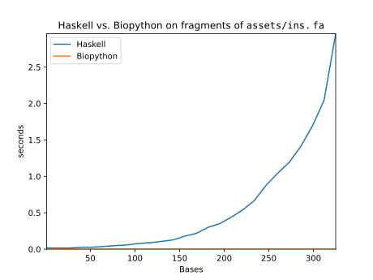
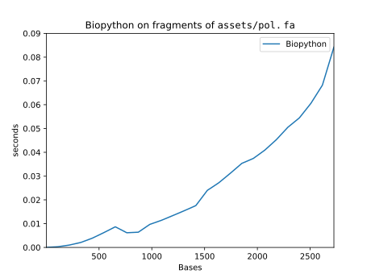
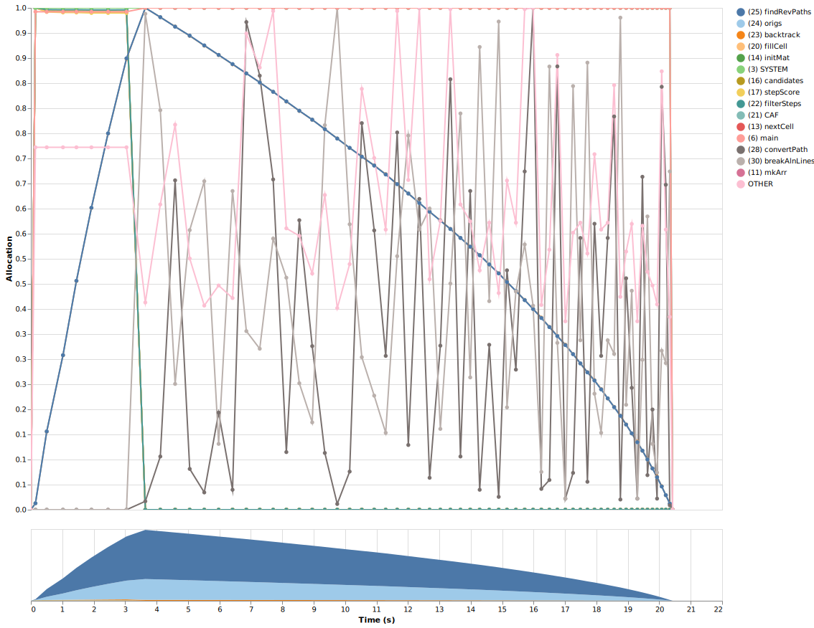
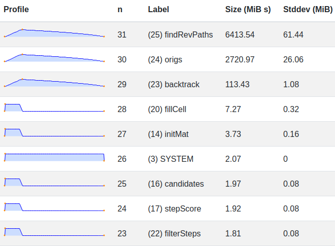

# Diskussion

In diesem Kapitel interpretieren wir die Ergebnisse und diskutieren etwaige Probleme mit diesen und die sich daraus ergebenden Limitationen.
Zuletzt besprechen wir potentielle Ergänzungen des Modells, sowie Ansätze für interessante Folgefragen.

## Zusammenfassung

Zunächst werden die Arbeitsergebnisse zusammengefasst.
An dieser Stelle sei nochmal auf die verwendete [Notation](#1_2_structures_and_notation) verwiesen.

### Problemformulierung

Um das Problem zu formulieren, haben wir eingangs in (eq:template-matrix) den Begriff des Alignments formalisiert.
Ein Alignment bzw. ein Template ist eine Matrix, der zeilenweise Sequenzen (eq:sequence-definition), bzw. deren Symbole zugeordnet werden.

#### Variablen

Alignments stellen das gewünschte Ergebnis dar.
Wir wissen dabei noch nicht, wie diese belegt werden.
Daher haben wir anschließend in (eq:assignment-var) Zuweisungsvariablen formuliert, aus denen sich die Belegung ergibt.
Da wir Bestimmung der Güte eines Alignments wissen müssen, an welchen Stellen Lücken sind, haben wir in (eq:gap-var) aus den Zuweisungsvariablen eine entsprechende Hilfsvariable abgeleitet.

#### Beschränkungen

Bestimmte Belegungen von Alignments stellen bilden keine validen Lösungen.
Dies haben wir in (eq:constraint-rows), (eq:constraint-cols) und (eq:constraint-order) durch die Formulierung von drei Beschränkungen für Zuweisungsvariablen dargestellt.

#### Zielfunktion

Lineare Optimierungsprobleme lassen sich im Allgemeinen leichter lösen als nicht-lineare.
Da wir bei der Kostenbestimmung anhand der zuvor definierten Variablen mehrere Unbekannte miteinander multiplizieren, haben wir in (eq:phi) und (eq:gamma) weitere Hilfsgrößen abgeleitet, um die Linearität zu bewahren.

In (eq:objective) ist dann auf Basis dieser Hilfsgrößen ein Bewertungskriterium für Alignmentgüte formuliert, welches bei Bestimmung des Optimums zu der Problemformulierung in (eq:milp-problem-equation) führt.

### Problemlösung

Um das aufgestellte Problem zu lösen, haben wir daraufhin den naiven Ansatz des Ausprobierens betrachtet und zügig erkannt, dass dieser aufgrund kombinatorischer Explosion nicht zielführend ist.
Da die optimale, globale, paarweise Sequenzalinierung ein bereits durch den klassischen Algorithmus von Needleman und Wunsch gelöstes Problem ist, lag anschließend die Überlegung nahe, einen [Ansatz](#solve_milp_with_nw) auf dessen Basis zu formulieren.

#### Reinterpretation von Needleman-Wunsch

Um NW hinsichtlich des MILP-Modells umzuformulieren, wurde in (eq:path-definition) der Begriff des Pfades als Folge von $K$-Tupeln über der Indexmenge $C_F$ einer von NW produzierten Alignmentmatrix $F$ eingeführt.[^nw_mat_and_mat_index_set]
Im Weiteren wurden Regeln bestimmt, denen Pfade genügen müssen.

[^nw_mat_and_mat_index_set]: Alignmentmatrizen sind in (eq:nw-mat-definition), bzw. (eq:nw-recurrence-anchor) und (eq:nw-recurrence-relation) beschrieben.
    Die Indexmengen von Alignmentmatrizen sind in (eq:nw-mat-index-set) definiert.

Aus dem Pfadbegriff haben wir im Anschluss in (eq:step-definition) formal der Begriff des Schrittes, als geordnetes Paar aufeinanderfolgender Pfadelemente abgeleitet und festgestellt, dass Schritte festgelegten, danach beschriebenen Regeln gehorchen.

Auf Basis der in (eq:nw-recurrence-relation) beschriebenen kanonischen Rekursionsbeziehung für NW haben wir dann in (eq:naive-step-weight) eine Gewichtsfunktion für Schritte abgeleitet.

NW berechnet den Wert des optimalen Teilalignments von $s^1$ bis $i$ und $s^2$ bis $j$ in Zelle $f_{ij}$ aufgrund einer oder mehrerer Vorgängerzellen $f_{gh}$ und produziert so Pfade durch $F$, die die optimalen Alignments von $s^1$ und $s^2$ darstellen.
Der Pfadbegriff in NW entspricht daher dem Begriff des Alignments in MILP.
Aus dieser Tatsache wurde in (eq:naive-step-objective) eine Zielfunktion in geschlossener Form formuliert, die den Wert des von NW produzierten Alignments beschreibt.

#### Anpassung für feste Alignmentlängen

Die geschlossene Formulierung der Zielfunktion in (eq:naive-step-objective) nutzt die Variable $K$, die der Länge des berechneten Pfades entspricht.
Daraus ergibt sich die Notwendigkeit, $K$ zu festzusetzen, weil (eq:naive-step-objective) sonst undefiniert wäre.
Ein weiterer verwandter Grund, $K$ festzusetzen ist, dass das MILP-Modell mit festen Alignmentlängen arbeitet und diese von NW emuliert werden müssen, um das aufgestellte Modell zu lösen.

Bei der Untersuchung des Problems wurde zunächst mit (eq:gapcounts) die Anzahl der in eine bestimmte Sequenz einbaubaren Gaps beschrieben.
Auf dieser Basis konnte mit (eq:range) ein *notwendiges* Kriterium[^not_sufficient] zur Einhaltung der Alignmentlänge identifiziert, durch das die ursprünglich aus (eq:nw-recurrence-relation) stammende und in (eq:naive-candidates) explizit gemachte Formulierung der Kandidatenwahl zu (eq:candidates) angepasst wurde.

[^not_sufficient]: Das gefundene Kriterium ist notwendig, nicht aber hinreichend um die Einhaltung zu garantieren.
    Mehr dazu findet sich in der [entsprechenden Sektion](#guaranteeing_aln_length) zur Diskussion der Limitationen.

#### Herleitung der Variablen

Mithilfe der formulierten Strukturen wurden mit (eq:step-assignment-var) die Zuweisungsvariablen und mit (eq:step-gap-var) die Gapvariablen hergeleitet.
In (eq:step-phi) und (eq:step-gamma) wurden die Hilfsvariablen $\phi_{ijk}$ und $\gamma_k$ in den NW-Kontext übertragen und dabei gezeigt, dass diese konsistent mit den ursprünglichen Definitionen in (eq:phi) und (eq:gamma) sind.

#### Herleitung der Beschränkungen

Für die hergeleiteten Zuweisungsvariablen wurde mittels der für Pfade und Schritte identifizierten Regeln [bewiesen](#nw-constraint-equivalence), dass die im MILP-Modell aufgestellten Beschränkungen auch für die aus NW hergeleiteten Variablen gelten.

#### Herleitung der Zielfunktion

In das in (eq:naive-step-weight) formulierte Schrittgewicht wurden die hergeleiteten Entscheidungsvariablen eingesetzt, wodurch sich (eq:step-weight) ergab.
Durch Einsetzen der neuen Form in (eq:naive-step-objective) entsteht (eq:step-objective-simple), das sich äquivalent zu (eq:step-objective) übersetzen lässt.

Dies entspricht der ursprünglichen und in (eq:milp-problem-equation) beschriebenen MILP-Problemformulierung.

### Implementation

Im Implementationsteil wurden die entwickelten Lösungsansätze im Stil der literarischen Programmierung in Programme umgewandelt.
Dabei wurde zuerst der naive Ansatz implementiert, um die Leserschaft langsam an die genutzte Programmiersprache Haskell heranzuführen.

Die Implementierungen stellen zuerst die Datentypen vor, die notwendig sind, um das Problem zu beschreiben und entwickeln dann auf Basis der Erkenntnisse aus den vorigen Kapiteln Funktionen zur Problemlösung.

Das Vorgehen folgte einer narrativen Struktur.
Bei der Implementation von NW wurden zuerst die Funktionen zur Initialisierung einer Alignmentmatrix $F$ geschrieben und dann die zum Befüllen notwendige Rekursionsbeziehung implementiert.
Anschließend wurden die Logik zum Generieren der Alignments durch Backtracking hinzugefügt und zuletzt alle Teile zu einer einzigen `align` Funktion komponiert.

Außerdem wurden Repräsentationsfunktionen, IO-Logik und Projekt-relevante Quellen zur Paketierung geschrieben, obgleich diese für die eigentliche Problemlösung keine Bedeutung besitzen.

### Verifikation

Im Rahmen der Verifikation haben wir die zentralen Teile der Implementation betrachtet, um zu prüfen, ob das Programm die zuvor im Problemlösungsteil beschriebene Spezifikation erfüllt.

#### Grundlegende Funktionen

Zuerst wurde die Korrektheit grundlegender Komponenten gezeigt, so dass spätere Beweise für komplexere Funktionen sich direkt darauf stützen können.

Dabei wurde nachgewiesen, dass die Kostenfunktionen [`substWeight` und `stepWeight`](#weight) den Definitionen in (eq:substitution-weight) und (eq:naive-step-weight) entsprechen und dass die [`gapCounts`](#type-aln-info) und [`range`](#range-hs) Funktionen die zur Kandidatenwahl notwendige Bestimmung der Gapzahlen (eq:gapcounts) und das Abstandskriterium (eq:range) korrekt implementieren.

#### Kandidatenwahl

Auf dieser Grundlage konnte zugleich die in (eq:candidates) beschriebene und in [`candidates`](#candidates-hs) implementierte Auswahlfunktion für Schrittkandidaten verifiziert werden.

#### Maximierung des Zellwerts

Durch Induktion über die Kandidatenliste, die der Funktion [`maxValue`](#max-value)  übergeben wird, konnte gezeigt werden, dass bei Terminierung der höchste Zellwert produziert wird und `maxValue` daher den durch Wahl eines Kandidatenschrittes entstehenden Zellwert maximiert.

#### Füllregeln

Zuletzt wurden die in (eq:recurrence-anchor) definierten Rekursionsanker und die in (eq:recurrence-relation) definierte Rekursionsbeziehung betrachtet.
Es ließ sich nachweisen, dass [`initFillFunc`](#init-fill-func) bzw. deren Komponenten dem Rekursionsanker entsprechen, und dass [`fillCell`](#fill-cell) die Rekursionsbeziehung darstellt.

## Interpretation

Bei eingehender Betrachtung ergaben sich klare semantische Analogien zwischen dem beschriebenen MILP-Modell und dem NW-Algorithmus.
Man kann zudem zeigen, dass sich durch bestimmte Anpassungen von NW die im MILP formulierte Problemstruktur bewahren lässt.

Da das MILP-Modell und NW denselben Zweck verfolgen, liegt die Vermutung, dass die Formulierungen sich isomorph zueinander verhalten, zwar nahe, aber es ist trotzdem überraschend, wie schön bestimmte Zusammenhänge ins Schloss fallen.

Bei der Implementation hat sich im Zusammenhang mit den im Folgenden besprochenen Problemen gezeigt, dass durch Korrektheitsbeweise nicht automatisch qualitativ hochwertige Software entsteht.
Beweise können im besten Fall die Korrektheit funktionaler Anforderungen[^security] zeigen, sind aber nicht geeignet, um nicht-funktionale Anforderungen wie allgemeine Nutzbarkeit nachzuweisen.

[^security]: Solche Anforderungen die Systemverhalten spezifizieren.

Beweise können trotzdem sehr nützlich sein und es kann Sinn ergeben einen Korrektheitsbeweis zu führen um die Funktion einer Komponente zu verifizieren.
Dies gilt insbesondere für kritische Systemteile, mit überschaubarer Spezifikation.
Beweise ersetzen allerdings keine Tests und sind, wie auch das Testen, mit einem Aufwand verbunden, den nicht jeder zu zahlen bereit ist.

**Neue Resultate?**

Der Zusammenhang Isomorphie von NW und MILP

## Limitationen

 Es gibt einige Probleme mit dem im Rahmen der Arbeit aufgestellten Modell.

### Komplexität biologischer Fragestellungen

Die biologische Realität ist komplizierter als dargestellt.

Einerseits existieren weitere Arten von Mutationen als Substitutionen und Indels und andererseits muss die gewählte Interpretation[^interpretation_missmatch_gap] nicht unbedingt die biologische Realität widerspiegeln.

[^interpretation_missmatch_gap]: Mismatches sind Substitutionen und Gaps sind Indels.

Bspw. müssen Mismatches im Alignment nicht unbedingt aus der einfachen Substitution einzelner Basen herrühren, sondern z.B. aus der gleichzeitigen Substitution mehrerer Basen, oder wiederholter Substitution einer einzelnen Base.
Genauso könnte die Existenz von Gaps im Alignment auf strukturellen Veränderungen beruhen, bei denen Teile einer Sequenz miteinander vertauscht wurden.

Sinn von Modellen ist es, eine vereinfachte, zweckorientierte Nachbildung des zu betrachtenden Systems und dessen Prozessen zu geben.
Diese Ungenauigkeit liegt bei der Modellierung komplexer Sachverhalte also in der Natur der Sache.

### Spezifikation des Lösungsraums

Üblicherweise werden [Optimierungsprobleme](#1_2_optimization) in der Form $\max \{c^{\top}x: Ax \le b, x \le 0\}$ dargestellt, wobei der Vektor $x \in \mathbb{R}^n$ ein Punkt in einem $n$-dimensionalen Polytop ist, dessen Facetten durch die mit $Ax \le b$ formulierten Beschränkungen gegeben sind.

Es wäre schöner, wenn wir die Beschränkungen umformulierten, um ein ideales[^definitions_poly_ideal_formulation] Polytop $P$ zu finden, mit dem wir den Lösungsraumes $X$ darstellen können.

[^definitions_poly_ideal_formulation]: [Vgl. @wolsey Definition 1.1, pp. 12]

### Garantie fester Alignmentlängen {#guaranteeing_aln_length}

Die Formulierung von NW für feste Alignmentlängen ist nicht ausreichend.

Unser Algorithmus wird in manchen Fällen mehr als $\mathfrak{g}_\text{max}$ Gaps einbauen.
Der Grund dafür ist, dass das $\mathrm{range}$ Prädikat, welches den Abstand eines Kandidaten zur Hauptdiagonale prüft ein notwendiges, aber kein hinreichendes Kriterium ist.

```
ghci> let info = mkInfo 1 (-1) (-2) 0 "AGTAC" "ATGC"
ghci> putStrLn $ (showAln.head.optAlns.align) info
AG-T-A-C-
---------
--A-T-G-C
```

Dies passiert regelmäßig in Fällen, in denen $w_\text{gap}$ kleiner ist als $w_\text{match}$ und $w_\text{miss}$.[^pathological_case]

[^pathological_case]: Man könnte diese Fälle als pathologisch bezeichnen, da sie nicht nur unintuitive Ergebnisse erzeugen, sondern auch biologisch keinen Sinn ergeben.

#### Kandidatenwahl mit erweitertem Abbruchkriterium

Dieses Problem zu beheben ist nicht trivial, aber möglich.

Wir können beim Berechnen der Zellwerte bereits Eintragen, wie viele Gaps auf dem Weg zu dieser Zelle eingebaut wurden.

Als Rekursionsanker dienen $\mathfrak{g}_{i0} = i$ und $\mathfrak{g}_{0j} = j$.

Wenn für Zelle $f_{ij}$ der potentielle Vorgänger $f_{gh}$ den besten Wert liefert, dann entspricht die Anzahl der Gaps $\mathfrak{g}_{ij}$, welche wir auf dem Weg nach $f_{ij}$ einbauen, der Anzahl $\mathfrak{g}_{gh}$ von Gaps bis zum Vorgänger $f_{gh}$, im Falle von diagonalen Schritten und $\mathfrak{g}_{gh} + 1$ bei horizontalen oder vertikalen Schritten.

$$
\label{candidate-gaps}
\mathfrak{g}_{ij} = \begin{cases}
    \mathfrak{g}_{gh}     & , i = g + 1 \land j = h + 1 \\
    \mathfrak{g}_{gh} + 1 & , \text{Andernfalls} \\
\end{cases}
$$

Da wir $\mathfrak{g}_{ij}$ im gleichen Schritt wie $f_{ij}$ berechnen können und dies pro Zelle zusätzlich nur konstante Rechenzeit und Speicher erfordert, sollte diese Korrektur weder Zeit- noch Speicherkomplexität beeinflussen.

Außerdem kann $\mathfrak{g}_{ij}$ als zusätzlicher "Tie-Breaker" dienen, wenn die Werte $f_{gh}$ verschiedener Kandidatenschritte gleich sind.

Mit (eq:candidate-gaps) können wir unsere Funktion zur Kandidatenwahl anpassen und prüfen, ob die Anzahl an Gaps, die durch einen bestimmten Kandidaten entstehen zu hoch wird.
Damit ergibt sich die folgende korrigierte Funktion:

$$
\label{fixed-gap-candidates}
\mathrm{candidates}(i, j) = \{c = (g, h) \in C_{ij} \mathbin{|} \mathrm{range}(c) \land \mathfrak{g}_{gh} \le K \}
$$

### Performance {#bad_performance}

Beim Profilen des Programms stellte sich heraus, dass es nur ungenügende Performancecharacteristika hat.
So wie sie ist, kann die Implementation nicht sinnvoll in der Praxis genutzt werden.

Der Code mit dem das Profiling erfolgte und zur Generierung der folgenden Graphiken befindet sich in dem Skript `assets/scripts/profile_aligner.py`{.bare}.
Weiterhin wurde das [`eventlog2html`{.bare}](https://hackage.haskell.org/package/eventlog2html) Paket verwendet um aus den `assets/profiling`{.bare} hinterlegten Heap-Dumps die Informationen zur Speicherkomplexitätsanalyse zu extrahieren.

#### Zeitkomplexität {#time_analysis}

Es [hat sich gezeigt](#failed_test_performance), dass die Berechnung des Alignments für die Sequenzen in `pol.fa`{.bare} nicht in angemessener Zeit gelöst werden konnte.

::: info
{width=50%}
{width=50%}

\captiontwothrice{
    Ausführungszeiten von der Haskell-Implementation und Biopythons \texttt{PairwiseAligner} im Vergleich.
}{
    Ausführungszeiten von Haskell und Biopython auf Teilstücken von \texttt{assets/ins.fa}
}{
    Ausführungszeiten von Biopython auf Teilstücken von \texttt{assets/pol.fa}
}

Die Ausführungszeiten beider Algorithmen steigen klar exponentiell mit der Länge der verarbeiteten Sequenzen, allerdings ist klar zu sehen, dass das Steigungsverhalten der im Rahmen dieser Arbeit entwickelten NW-Implementation deutlich schlechter ist.
Zur Berechnung des Alignments der `pol.fa`{.bare} Sequenzen, an denen die Haskell-Implementation scheiterte, brauchte Biopython mit identischen Parametern ca. 0,08 Sekunden.
:::

Die Zeitkomplexität von NW für zwei Sequenzen mit Längen $m$ und $n$ liegt üblicherweise in der Klasse $\mathcal{O}(m \cdot n)$.
Diese Einordnung setzt allerdings voraus, das Einfügeoperationen in Matritzen in konstanter Zeit stattfinden.
Das `matrix` Paket generiert beim Setzen eines Elements allerdings eine neue Matrix, anstatt die bestehende zu mutieren, weswegen Aufrufe von `setElem` nicht in der Klasse $\mathcal{O}(1)$, sondern in $\mathcal{O}(m \cdot n)$ liegen.
Da der Algorithmus $m \cdot n$ Zellen in $F$ befüllen muss, steigt die zu Ausführungszeit mit $\mathcal{O}(m^2 \cdot n^2)$.

Des Werte nicht verändert, sondern kopiert, werden ergibt Sinn, da Haskell eine pure funktionale Sprache ist, in der alle Werte immutabel sind.
Dies kann aber umgangen werden, indem statt einer normalen `Matrix` eine mutable `MMatrix` verwendet wird, deren Zellen innerhalb einer Monade in konstanter Zeit mutiert werden können.

Da Monaden einfach nur Monoide in der Kategorie der Endofunktoren sind, ist dies konzeptionell natürlich trivial, aber leider reicht, zum Zeitpunkt an dem ich diese Worte schreibe, die Bearbeitungszeit dafür nicht mehr aus.

Ein weiteres gravierendes Problem liegt im ineffizienten Backtracking-Algorithmus, der die Ausführungszeiten noch weiter aufbläht.
Weitere sich aus dem Backtracking ergebende Probleme betrachten wir in der nächsten Sektion.

#### Speicherkomplexität {#space_analysis}

Auch die Speichernutzung des Programms disqualifiziert es für den praktischen Gebrauch.

::: info
Bei der Betrachtung der Speichernutzung über den Zeitverlauf fällt auf, dass die Nutzung zuerst explosionsartig zunimmt und dann nach und nach abgebaut wird.

{width=45%}
\hfill
{width=45%}

\captiontwothrice{
    Die Speicherauslastung beim Alinieren der ersten 125 Symbole von \texttt{pol.fa}.
}{
    Die Größe des Heaps gibt uns eine Übersicht über die Gesamtauslaustung des Speichers während der Ausführung.
}{
    Der größte Verbrauch entsteht beim Backtracking in der \texttt{findRevPaths} Funktion.
}

Erinnern wir uns an die [Definition](#find-rev-paths) von `findRevPaths :: NWMatrix -> MatIdx -> [Path]`.

```haskell
-- ... excerpt abridged for clarity ...
findRevPaths mat cell = (prepend.collect.continue) cellOrigs
  where
    cellOrigs = origs cell elem
    continue  = map (findRevPaths mat)
    collect   = concat
    prepend   = map (cell:)
```

Wir erweitern zunächst den Pfad von den bisher gefundenen Vorgängern aus, fassen die so entstandenen Subpfade im nächsten Schritt zusammen und fügen die betrachtete Zelle am Schluss vorne an alle gesammelten Subpfade an.

D.h. es werden alle möglichen Pfade berechnet, bevor eine Rückgabe stattfindet.
:::

Potentiell existieren bei jedem Schritt durch die Matrix drei Möglichkeiten den Pfad weiterzuführen.
Mit insgesamt $K$ Schritten,[^dim_not_step_count] ergeben sich schlimmsten Fall $\prod_{k = 1}^{K} 3$ mögliche optimale Alignments produzieren.

[^dim_not_step_count]: Die wirkliche Komplexität hängt von der festen Dimension der Matrix und nicht der variablen Schrittzahl ab, aber die Darstellung mit Schritten ist deutlich anschaulicher.

Diese Anzahl von möglichen Alignments steigt also mit $K!$.



### Grenzen der Beweisbarkeit

Das gewählte Modell der Verifikation durch händische Beweise hat verschiedene Beschränkungen.

#### Implizite Annahmen

Strenggenommen ist der Beweis der Korrektheit eines Programmes nicht so einfach, wie wir es beschrieben haben.
Zusätzlich zum Beweis, dass der Code korrekt ist, müssten wir u.a. zeigen,

1. dass die Semantik der Sprache korrekt implementiert ist, dass also der Compiler/Interpreter die Sprachkonstrukte in die Maschinenanweisungen übersetzt, die wir erwarten, und
2. dass der Prozessor diese Anweisungen auch richtig verarbeitet.[^pentium_fdiv]

[^pentium_fdiv]: Diese Annahme galt z.B. nicht für die vom FDIV-Bug betroffenen Intel-Pentium-Prozessoren, was wahrscheinlich einer der Gründe ist, warum Intel in nachfolgenden Modellen begann verstärkt Methoden der formalen Verifikation zu nutzen.
    Vgl. @roope09.

In der Praxis gehen wir jedoch i.d.R. davon aus, dass die Betrachtung des Programmcodes ausreicht und die restlichen Teile des Systems ordnungsgemäß funktionieren.

#### Refaktorierung von Programm und Beweis

Mit der Größe und Komplexität eines Programmes steigt auch die Schwierigkeit des Beweises.
Deswegen ist es sinnvoll Programm und Korrektheitsbeweis synchron zu schreiben.

Dies erfordert allerdings, dass Änderungen am Programm eine Anpassung der Beweisführung nach sich ziehen.
Dadurch wird das Refaktorieren des Programms deutlich erschwert.

#### Korrektheit von Beweisen

Genauso wie Programme können auch Beweise Fehler haben.

Bei langen händischen Berechnungen ist leicht Fehler zu machen und schwer zu prüfen, ob diese korrekt sind.
Bei händischen Beweisen ist es genauso.

Haskell Curry[^haskell_namesake] und William Howard haben entdeckt, dass Programme und Beweise isomorph sind. @curry80
Dieses Ergebnis wird als Curry-Howard-Korrespondenz bezeichnet.
Durch diese Korrespondenz wissen wir, dass Beweise programmatisch darstellbar sind, was die Grundlage für Beweisassistenten wie [Coq](https://github.com/coq/coq/) darstellt.

[^haskell_namesake]: Haskell Curry ist der Namenspatron der Programmiersprache Haskell.

Auch ein programmatischer Beweis kann falsch sein, wenn das Modell nicht korrekt abgebildet wurde oder falsche Annahmen gemacht wurden.
Es ist allerdings leichter zu prüfen, ob eine Summenfunktion korrekt implementiert ist, als manuell die Korrektheit der Summe von 1.000 Zahlen zu bestimmen.
Ebenso ist es ggf. leichter sich von der Korrektheit eines programmatischen, als von der eines manuellen Beweises zu überzeugen.

## Ergänzungen

Es gibt verschiedene Möglichkeiten das aufgestellte Modell sinnvoll zu erweitern.

### Affine Gapkosten

Um affine Gapkosten mit unterschiedlichen Werten für Öffnen und Erweitern von Gaps zu modellieren, wie in @mc_allister07, bräuchten wir extra Variablen an denen wir Start und Ende von Gaps ablesen können.
Da an jeder Stelle des Templates potentiell ein Gap auftreten kann, wäre eine Variable für jedes Feld im Template notwendig.

Wir können sehen, dass auch diese Variablen als "Lückenmatrix" $\mathcal{G} \in \mathbb{B}^{|S| \times K}$, mit denselben Dimensionen wie $T$, darstellbar sind.

$$
\mathcal{G} = (g^m_k)
\qquad
g^m_k = \begin{cases}
    1, & t^m_k := c_\text{gap} \\
    0, & \text{Andernfalls} \\
\end{cases}
$$

Auch hier stellen wir den Zeilenindex hoch, um den Zusammenhang mit $s^m$ zu kennzeichnen.

::: {#interpretation-gap-matrix}
Die Gapmatrix $\mathcal{G}$ bezieht sich also auf das gesamte Alignment $T$.

Auch bei $\mathcal{G}$ gibt es eine sinnvolle Interpretation der Indizes.
Die Positionen entsprechen einfach [denen des Templates](#interpretation-template-matrix), d.h. der Zeilenindex bestimmt auf welche Sequenz Bezug genommen wird und der Spaltenindex spiegelt die, potentiell mit Gaps aufgefüllte, Position im Alignment wider.
:::

::: {#gap_mat_example}
:::: example
Die Befüllung des zuvor gegebenen [Beispieltemplates](#template_example) $\begin{smallmatrix} \mathrm{A} & \mathrm{G} & \mathrm{T} & \mathrm{A} & \mathrm{C} & \mathrm{-} \\ \mathrm{A} & \mathrm{-} & \mathrm{T} & \mathrm{G} & \mathrm{C} & \mathrm{-} \\ \end{smallmatrix}$ mit Gapsymbolen wird durch die folgende Gapmatrix dargestellt:

$$
\mathcal{G} = \begin{pmatrix}
    0 & 0 & 0 & 0 & 0 & 1 \\
    0 & 1 & 0 & 0 & 0 & 1 \\
\end{pmatrix}
$$

::::
:::

Wenn wir zum Modellieren affiner Gapkosten von $L$ Sequenzen eine Gapmatrix $(g^m_k) = \mathcal{G} \in \mathbb{B}^{L \times K}$ definiert haben, besteht ein klarer Zusammenhang zwischen Sequenzsymbolen und Gaps.

Wir wissen, dass an einer Stelle, an der ein Sequenzsymbol zugewiesen wurde, kein Gap sein kann, und dass umgekehrt an einer Stelle, an der kein Sequenzsymbol zugewiesen wurde, ein Gap sein muss.

$$
\forall k \in J_K: g^m_j = 1 - \sum_{i = 1}^{|s^m|} a^m_{ik}
$$

Gaps $g^m_k$ sind also genau an den Stellen $t^m_k$, wo keine Sequenzsymbole zugewiesen wurden.

### Erweiterung auf MSA

Mit den für das MILP [definierten Variablen](#1_3_1_variables) können wir auch direkt eine Zielfunktion für das multiple Sequenzalignment aufstellen.

Bei MSA können wir Sequenzen in einer Menge $S$ paarweise miteinander vergleichen und aufsummieren, um die Gesamtkosten zu bestimmen.

Wir betrachten zwei verschiedene Sequenzen $s^m$ und $s^n$ aus $S = \{s^1, \dots, s^L\}$ mit $m, n \in J_L, m \neq n$.

Die Definitionen für $a^m_{ik}$ bzw. $a^n_{jk}$  und $g^m_k$ bzw. $g^n_k$ bleiben unverändert und entsprechen (eq:assignment-var) bzw. (eq:gap-var).

Wir schreiben $w^{mn}_{ij}$ für das Gewicht einer Substitution zwischen $s^m_i$ und $s^n_j$.
Dieses kann entweder wie (eq:substitution-weight) flache Kosten benutzen, oder analog zu (eq:substitution-weight-mat) anhand einer Substitutionsmatrix $W$ als $w^{mn}_{ij} = W_{s^m_i, s^n_j}$ bestimmt werden.

$$
\label{substitution-weight-msa}
w^{mn}_{ij} = \begin{cases}
    w_\text{match} & , s^m_i = s^n_j \\
    w_\text{miss} & , \text{Andernfalls} \\
\end{cases}
$$

Wir definieren außerdem zwei Familien von Entscheidungsfunktionen $\phi^{mn}_{ij}(k): \mathbb{N} \to \mathbb{B}$ und $\gamma^{mn}(k): \mathbb{N} \to \mathbb{B}$.

$$
\label{phi-gamma-msa}
\phi^{mn}_{ij}(k) = a^m_{ik} \cdot a^n_{jk}
\qquad
\gamma^{mn}(k) = |g^m_k - g^n_k|
$$

Die Funktion $\phi^{mn}_{ij}$  entspricht (eq:phi) aus der PSA-Formulierung und sagt aus, ob die Sequenzsymbole $s^m_i$ und $s^n_j$ in dieselbe Templatespalte $t_k$ eingetragen wurden.
Die Funktion $\gamma^{mn}$ enspricht (eq:gamma) aus der PSA-Formulierung sagt aus, ob es an der Stelle $t_k$ einen Gap zwischen $s^m$ und $s^n$ gibt.

Wir schreiben verkürzt $\phi^{mn}_{ijk}$, bzw. $\gamma^{mn}_k$.

Die Zielfunktion ist analog zu (eq:objective) gegeben durch:

$$
\label{objective-msa}
\sum_{m = 1}^L \sum_{n = 1}^L
\left[
    [m \ne n] \cdot
    \sum_{k = 1}^K
    \left[
        w_\text{gap} \cdot \gamma^{mn}_k +
        \sum_{i = 1}^{|s^m|} \sum_{j = 1}^{|s^n|}
        \left[ w^{mn}_{ij} \cdot \phi^{mn}_{ijk} \right]
    \right]
\right]
$$

Hier wird beachtet, dass nur die Kosten von unterschiedlichen Sequenzen betrachtet werden.

#### Needleman-Wunsch für multiple Sequenzalinierung

Im Allgemeinen lässt sich NW für eine Menge $S = \{s^1, \dots, s^L\}$ von $L$ Sequenzen formulieren.

Wir nutzen im Folgenden Multiindexnotation mit $\alpha = (\alpha^1, \dots, \alpha^L)$ und komponentenweiser Addition, Subtraktion und Multiplikation.

##### $F$ als Tensor

Sei $(f_\iota) = F$ ein Tensor mit Dimension $\bigtimes_{i=1}^L |s^i|+1$.
Die einzelnen Richtungen des Tensors korrespondieren mit den verschiedenen Sequenzen und die jeweiligen Indexkomponenten mit den Sequenzpositionen.

Analog zur [ursprünglichen Interpretation](#nw_step_interpretation), weisen Änderungen am Index in einer bestimmten Dimension auf den Einbau des entsprechenden Sequenzsymbols hin und ausbleibende Änderungen auf Gaps.

##### Rekursionsanker

In Anlehnung an (eq:nw-recurrence-anchor) dienen die an den Ursprung anliegenden Seiten des durch $F$ dargestellten Hyperwürfels als Rekursionsanker.

Sei $\iota_0$ ein Prädikat, welches aussagt, dass der Index $\iota$ eine Nullkomponente beinhaltet.

$$
\iota_0 = \left[ 0 \ne \sum_{i = 1}^{L} [\iota^i = 0]  \right]
$$

Der Rekursionsanker lässt sich dann folgendermaßen formulieren:

$$
f_\iota = \iota_0 \cdot \sum_{i = 1}^L \iota^i \cdot w_\text{gap}
$$

##### Rekursionsbeziehung

Um die nächste Zelle zu befüllen muss das Gewicht für einen Schritt von Vorgänger $f_\eta$ zu Nachfolger $f_\iota$ bestimmt werden.

**Schritte**

Für die Vorgänger $\eta$ von $\iota$ gilt, dass sich alle Komponenten höchstens um eins unterscheiden und dass es mindestens eine Komponente gibt die sich unterscheidet.

$$
\forall i \in J_L:  \eta_i \in \{\iota^i - 1, \iota^i\}
$$

Daher muss $\iota - \eta \in \mathbb{B}^L$ und $\iota - \eta \ne \mathbf{0}$.
Sei $\mathrm{prev}_\iota$ ein Prädikat, welches aussagt, ob ein Index Vorgänger von $\iota$ sein kann.

$$
\mathrm{prev}_\iota(\eta) = \iota - \eta \in \mathbb{B}^L \land \iota - \eta \ne \mathbf{0}
$$

Dann kann die Menge der Vorgänger von $\iota$ folgendermaßen dargestellt werden:

$$
\mathrm{precursors}_\iota = \{\eta \mathbin{|} \eta \in \mathbb{N}_0^L \land \mathrm{prev}_\iota(\eta)\}
$$

**Gapkosten**

Um die Gapkosten eines Schrittes zu bestimmen, vergleichen wir die Komponenten von Vorgänger $\eta$ und Ziel $\iota$ miteinander.
Die Gapkosten entsprechen der Summe über die unveränderten Komponenten.

$$
\sum_{i = 1}^L \left[ w_\text{gap} \cdot [\iota^i = \iota^i] \right]
$$

**Substitutionskosten**

Sei $w^{mn}_{ij}$ wie in (eq:substitution-weight-msa).

Um die gesamten Substitutionskosten zu bestimmen, wird die Summe der Substitutionskosten für alle veränderten Indizes gebildet.

Wir bauen $s^m_{\iota^m}$ ein, wenn $\iota^m \ne \eta^m$.

$$
\sum_{m = 1}^L \sum_{n = 1}^L
\left[
    w^{mn}_{\iota^m\iota^n} \cdot
    [m \ne n \land \iota^m \ne \eta^m \land \iota^n \ne \eta^n]
\right]
$$

**Gesamtkosten**

Um die Kosten für einen Schritt durch die Matrix zu erhalten, müssen wir zu allen Vorgängern $f_\eta$ von $f_\iota$ die Kosten von Substitutionen und Gaps addieren.

$$
w(\iota, \eta) =
\sum_{i = 1}^L \left[
    w_\text{gap} \cdot [\iota^i = \eta^i]
\right] +
\sum_{m = 1}^L \sum_{n = 1}^L \left[
    w^{mn}_{\iota^m\iota^n} \cdot
    [m \ne n \land \iota^m \ne \eta^m \land \iota^n \ne \eta^n]
\right]
$$

**Befüllungsregel**

Damit bekommen wir die folgende Befüllungsregel:

$$
f_\iota =
\max \left\{
    f_\eta + w(\iota, \eta)
    \ \middle| \ \eta \in \mathrm{precursors}_\iota
 \right\}
$$
