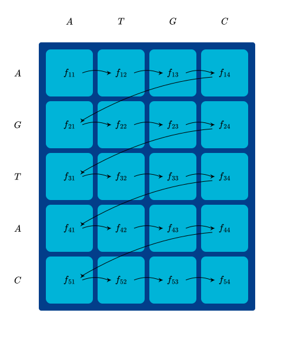
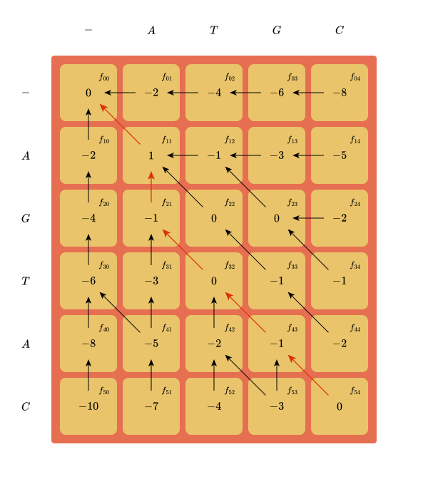
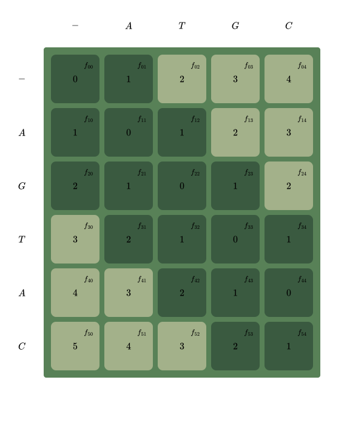
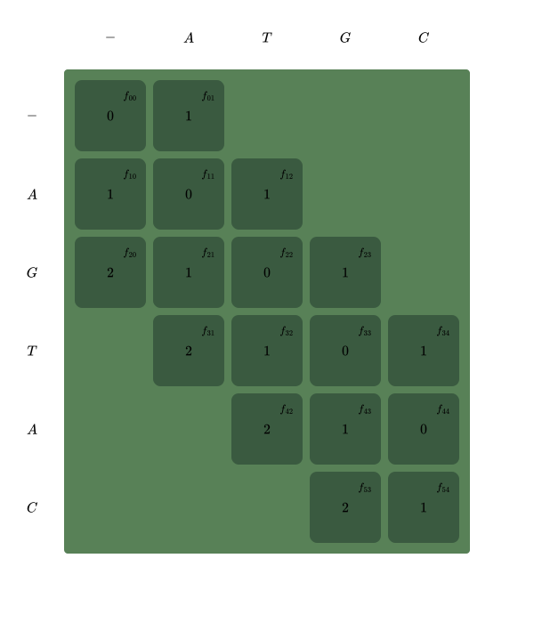
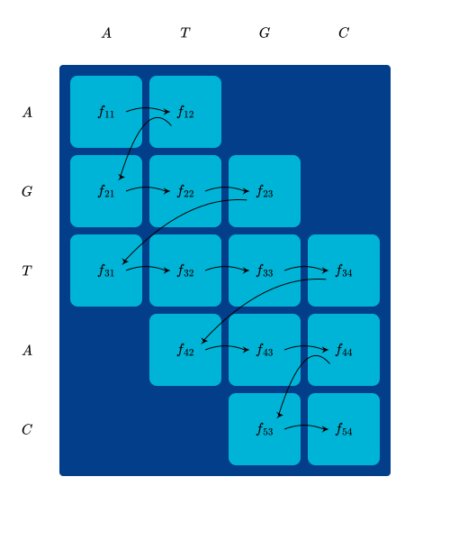
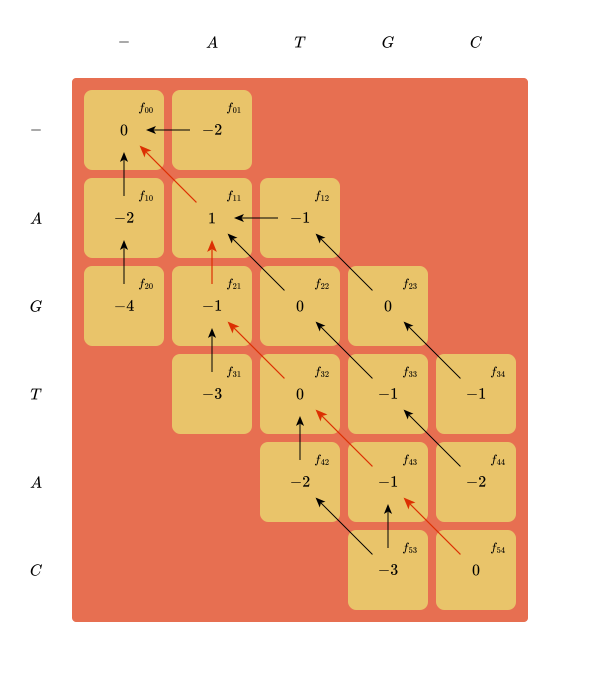

# Lösung des Optimierungsproblems

In dieser Sektion formulieren wir einen Lösungsansatz für das Problem.

Um ein Problem $Z = \max \{c(x) \mathbin{|} x \in X \subseteq \mathbb{Z}^n\}$ optimal zu lösen, müssen wir eine Eingabe $x^* \in X$ finden, bei der es nicht mehr möglich ist, den gefundenen Wert zu verbessern.
Wir wollen zeigen, dass $x^*$ auf den größten Funktionswert abbildet.

$$
\forall x \in X: c(x) \le c(x^*)
$$

Um unser Problemmodell zu lösen, gibt es verschiedene Ansätze.

## Ausprobieren {#2_1_exhaustive_search}

Die offensichtliche naive Strategie besteht darin alle validen Lösungen durchzuprobieren und sich die beste Eingabe zu merken.

Bei $|s^1| = M$ und $|s^2| = N$, gibt es $M! \cdot N!$ Permutationen alleine für die Sequenzsymbole.
Mit Gaps wird der Lösungsbereich noch größer.
Im Allgemeinen gibt es bei einem Template der Länge $K = \max \{M, N\} + \mathfrak{g}_\text{max}$ genau $(t!)^2$, mögliche Symbolzuordnungen.

Bei $t \approx 35$ gibt es mit $(35!)^2 \approx (10^{40})^2 = 10^{80}$ ungefähr so viele Lösungen wie Atome im sichtbaren Universum.
Dieser Ansatz wird nicht funktionieren, aber kann man ihn verbessern?

Der Lösungsraum lässt sich mithilfe der zuvor formulierten Beschränkungen verkleinern.
Diese erlauben es, ganze Klassen von Lösungen direkt aus der Betrachtung auszuschließen.

Bspw. sind Lösungen, welche die Sequenzreihenfolge durcheinander bringen, nicht valide.

### Intuition

Es ist klar, dass $\mathcal{G}$ eindeutig durch $\mathcal{A}^1$ und $\mathcal{A}^2$ festgelegt ist und umgekehrt.
Daher reicht es, entweder die validen Belegungen der Zuweisungsmatrizen, oder der Gapmatrix zu betrachten.

Da die Reihenfolge der Sequenzsymbolzuweisungen vorgegeben ist, aber Gaps an beliebigen Stellen eingebaut werden können, ist die Anzahl der möglichen Belegungen einer Assignmentmatrix auch von der Anzahl der Gaps bestimmt.
Die Anzahl an Gaps, die wir in das Alignment der Sequenz einbauen, entspricht der Differenz zwischen Sequenz- und Templatelänge.

Wir wissen, dass $\mathcal{A}^1 \in \mathbb{B}^{M \times K}, \mathcal{A}^2 \in \mathbb{B}^{N \times K}$, wobei die Zeilenzahl der Sequenz- und die Spaltenzahl der Templatelänge entspricht.
Für $\mathcal{A}^1$ ergibt sich $\Delta_{g_1} = K - M$ und für $\mathcal{A}^2$ analog $\Delta_{g_2} = K - N$ als Anzahl von Gaps, bzw. Leerspalten.

::: {#enumeration_example}
:::: example
Arbeiten wir weiter mit den Sequenzen aus unserem vorigen [Beispiel](#template_example), aber nehmen wir an, dass wir noch keine feste Belegung haben.

Wenn wir alle Zeilen, außer der letzten, belegt und bisher keine Leerspalten eingebaut haben, dann müssen alle verbleibenden Leerspalten in dieser Zeile Verwendung finden.

$$
\begin{pmatrix}
    1 & 0 & 0 & 0 & 0 & 0 \\
    0 & 1 & 0 & 0 & 0 & 0 \\
    0 & 0 & 1 & 0 & 0 & 0 \\
    0 & 0 & 0 & \text{-} & \text{-} & \text{-} \\
\end{pmatrix}
$$

Die Bindestriche symbolisieren valide Belegungen, von denen **genau eine** auf eins gesetzt werden muss.
Die Anzahl an Möglichkeiten das Sequenzsymbol $s^2_4$ zu positionieren ist dann $(6-4) + 1 = 3$, bzw. $\Delta_g + 1$.

Wenn in den vorigen Spalten bereits $g$ Leerspalten verwendet wurden, sinkt dieser Wert entsprechend.
Angenommen wir bauen einen Gaps in $t^2_3$ und $t^2_4$ ein, dann ändern sich auch die möglichen Belegungen.

$$
\begin{pmatrix}
    1 & 0 & 0 & 0 & 0 & 0 \\
    0 & 1 & 0 & 0 & 0 & 0 \\
    0 & 0 & \mathbf{0} & \mathbf{0} & 1 & 0 \\
    0 & 0 & 0 & 0 & 0 & \text{-} \\
\end{pmatrix}
$$

Die Anzahl an Möglichkeiten sinkt auf $\Delta_g + 1 - g$.
In diesem Fall haben wir $\Delta_g = g$ und damit $\Delta_g + 1 - g = 1$ nur eine mögliche Belegung.

::::
:::

Vorherige Gaps schränken spätere Belegungsmöglichkeiten ein.
Mithilfe dieser Erkenntnis können wir alle validen Möglichkeiten durchnummerieren, ähnlich, wie wir es in einer Wahrheitstafel machen würden.

Dazu können wir mit der erweiterten Einheitsmatrix $\left[\begin{smallmatrix} I_M & 0 \end{smallmatrix}\right]$ beginnen und wiederholt die Position in der letzten "beweglichen" Zeile nach rechts schieben, bis keine Bewegung mehr möglich ist.
Anschließend rücken wir die Zeile darüber eins weiter und setzen alle nachfolgenden Zeilen auf die erste valide Position.
Wir sind fertig, wenn keine Bewegung mehr möglich ist.

### Verteilung von Gaps

Da die Reihenfolge der Sequenzsymbole im Template unverändert bleibt, unterscheiden sich Alignments nur durch die Platzierung von Gaps.
Wenn wir wissen, an welchen Stellen im Template Gaps stehen, können wir also das Alignment vollständig bestimmen.

Nehmen wir an, dass wir in eine Sequenz $s$, mit Länge $M$ genau $k$ Gaps einbauen wollen.
D.h. wir wollen von $M$ Positionen im Template $k$ auswählen, wobei uns die Reihenfolge der Gaps nicht interessiert.
Das entspricht allen ungeordneten Stichproben, bzw. Kombinationen, mit Länge $k$ aus einer Menge mit $M$ Elementen.
Die Anzahl der $k$-Kombinationen aus dieser Menge ist durch den Binomialkoeffizienten $\binom{n}{k}$ gegeben.

#### Enumeration aller Kombinationen

Wie nummerieren wir diese allerdings?

Wir können eine Kombination $c$ auch als $k$-Tupel $(c_1, \dots, c_k)$ betrachten, dessen Elemente aus $J_n$ stammen und bei denen alle Elemente strikt kleiner als ihr Nachfolger sind.

$$
C^n_k = \{(c_1, \dots, c_k) \mathbin{|} c_i \in J_n, c_i < c_{i+1}, 1 \le i < k
$$

##### Anordnung der Kombinationen

Auf $C^n_k$ können wir nun eine lexikografische Ordnung definieren.

Zwei Kombinationen $c$ und $c'$ sind genau dann gleich, wenn alle ihre Elemente gleich sind.

$$
c = c' \iff \forall i \in J_k: c_i = c'_i
$$

Weiterhin ist $c$ genau dann kleiner als $c'$, wenn die erste Stelle, in der sie sich voneinander unterscheiden, kleiner ist.

$$
c < c' \iff \exists i: c_i < c'_i \land \forall i' < i: c_{i'} = c'_{i'}
$$

Die erste Kombination $c^1$ und letzte Kombination  $c^{\binom{n}{k}}$ in dieser Folge, sind durch $c^1 = (1, 2, \dots, k)$, bzw. $c^{\binom{n}{k}} = (n-k, n-k+1, \dots, n)$ gegeben.

::: {#proof-first-combination}
:::: info
Nehmen wir an, dass es eine Sequenz $c^0$ mit $c^0 < c^1$ gibt, dann muss es gemäß Definition einen ersten Index $i$ geben, in dem sich $c^0$ von $c^1$ unterscheidet.
Da $c^1_i = i$, folgt $c^0_i < i$.

Wir wissen, dass im Allgemeinen $c_i < c_{i+1}$ und daher im Speziellen $c^0_1 < \dots < c^0_{i-2} < c^0_{i-1} < c^0_i < i$.
Da $i, c^0_j \in \mathbb{N}$, ist die größtmögliche Zahl $c^0_{i-1}$ die $c^0_{i-1} < i$ erfüllt durch $c_{i-1} = i - 1$ gegeben.
Daraus folgt $c^0_1 = 0$ als höchstmöglicher Startwert für $c^0$, was im Widerspruch zu $c^0_i \in J_n$ steht. $\blacksquare$

Der Beweis für $c^{\binom{n}{k}}$ funktioniert analog.
::::
:::

##### Nachfolger einer Kombination

Der Nachfolger $S(c)$ einer Kombination $c$ wird dadurch erzeugt, dass wir die letzte Stelle $i$ inkrementieren, die sich inkrementieren lässt, ohne dass wir $C^n_k$ verlassen.

$$
i = \max \{i' \mathbin{|} c_{i'} + 1 \in J_n, (i' = n \lor c_{i'} < c_{i' + 1})\}
\quad
S(c) = (c_1, \dots, c_i + 1, c_i + 2, \dots)
$$

Eine Position $c_i$ kann minimal und maximal diese Werte annehmen: $i \le c_i \le n-k+i$.

Wenn $c_i < n - k + i$, dann können wir an Stelle $i$ inkrementieren, und falls $c_i = n - k + i$, dann interessiert uns die vorige Position $c_{i-1}$.
Wenn $c_i = n - k + i$ und $i = 1$, dann gibt es keine nachfolgende Kombination.

Nachdem an Stelle $i$ inkrementiert wurde, müssen die nachfolgenden Stellen zurückgesetzt werden.
Wenn $c'$ die auf $c$ folgende Kombination ist, die an Stelle $i$ inkrementiert wurde, mit $c'_i = c_i + 1$ ist, dann sind die folgenden Stellen gegeben durch $c'_{i+j} = c'_i + j$.
Wir können zeigen, dass dies die kleinste Subkombination sein muss, indem wir dieselbe Logik wie im [Beweis für die kleinste Kombination](#proof-first-combination) nutzen.

::: aside
**Todo:** Ausführen

Diese Kombinationen haben Ähnlichkeiten mit $M$-ären Zahlensystemen und Polynomen mit beschränkten Koeffizienten.
:::

Mit Sequenzen der Länge $M$, bzw. $M$ und Template Länge $K$ sind alle möglichen Kombinationen von Gapverteilungen durch die Menge $C^K_{K-M} \times C^K_{K-N}$ gegeben.

$$
\left| C^K_{K-M} \times C^K_{K-N} \right| =
\binom{K}{K-M} \cdot \binom{K}{K-N} =
\binom{K}{M} \cdot \binom{K}{N}
$$

Das ist schon deutlich besser, da wir nun auch deutlich längere Sequenzen verarbeiten können.
Bspw. kommen wir mit $|s^1| = |s^2| = 750$ und $\mathfrak{g}_\text{max} = 20$ auf $\binom{750}{20}^2 \approx 10^{78}$ Kombinationen, also ganze zwei Größenordnungen weniger als die Anzahl der Atome im sichtbaren Universum.

## Needleman-Wunsch {#solve_milp_with_nw}

Es ist offensichtlich, dass der naive Ansatz nicht gut genug ist.
Wie können wir diese riesige Menge an möglichen Lösungen sinnvoll händeln?
Eine Möglichkeit ist es, Methoden der dynamischen Programmierung zu nutzen.

Im Kontext der Sequenzalinierung bietet sich da insbesondere der Algorithmus von Needleman-Wunsch (**NW**) an.

::: {#nw_mat_example}
:::: example
Als kurze Auffrischung betrachten wir NW anhand eines praktischen Beispiels.

Für die Sequenzen $s^1 = \text{AGTAC}$ und $s^2 = \text{ATGC}$ des [Beispieltemplates](#template_example) mit $w_\text{match} = 1, w_\text{miss} = -1$ und $w_\text{gap} = -2$ werden zunächst die Rekursionsanker bestimmt, woraufhin die restliche Matrix Zeile für Zeile ausgefüllt werden kann.
Die Reihenfolge der Berechnungen und eine entsprechende Matrix $F$, mit rot eingezeichnetem optimalen Pfad sähe z.B. so aus:

{#nw_order_of_calculations width=45%}
\hfill
{#nw_steps width=45%}

\captiontwothrice{
    Reihenfolge der Berechnungen und ausgefüllte NW-Matrix.
}{
    Reihenfolge der Berechnungen
}{
    Ausgefüllte NW-Matrix
}

Wenn wir nach Befüllen der Matrix, von $f_{5,4}$ ausgehend, den optimalen Pfad zurückverfolgen ergibt sich das Alignment $\begin{smallmatrix} \rm{A} & \rm{G} & \rm{T} & \rm{A} & \rm{C} \\ \rm{A} & \rm{-} & \rm{T} & \rm{G} & \rm{C} \\ \end{smallmatrix}$ mit Wert $0$.
Würden wir uns für das optimale Alignment der Teilsequenzen $\rm{A}\rm{G}\rm{T}$ und $\rm{A}\rm{T}\rm{G}\rm{C}$ interessieren, könnten wir bei $f_{34}$ beginnen und erhielten das mit $-1$ gewertete Alignment $\begin{smallmatrix} \rm{A} & \rm{-} & \rm{G} & \rm{T} \\ \rm{A} & \rm{T} & \rm{G} & \rm{C} \\ \end{smallmatrix}$.
$\rm{A}\rm{G}\rm{T}\rm{A}\rm{C}$ und $\rm{A}\rm{T}\rm{G}$ können als $\begin{smallmatrix} \rm{A} & \rm{G} & \rm{T} & \rm{A} & \rm{C} \\ \rm{A} & \rm{-} & \rm{T} & \rm{G} & \rm{-} \\ \end{smallmatrix}$ oder $\begin{smallmatrix} \rm{A} & \rm{G} & \rm{T} & \rm{A} & \rm{C} \\ \rm{A} & \rm{-} & \rm{T} & \rm{-} & \rm{G} \\ \end{smallmatrix}$ gleichwertig mit einem Wert von $-3$ aligniert werden.
::::
:::

Allerdings möchten wir nicht einfach irgendwelche Matrizen befüllen, sondern unser MILP-Modell lösen.
Können wir NW hinsichtlich Modells umformulieren?

**Äquivalenz von NW und MILP**

Wir behaupten, dass NW[^modified_nw] eine Lösung für das initial formulierte MILP Problem findet.
Dies wollen wir mithilfe der folgenden Schritte zeigen.

[^modified_nw]: Bzw. eine angepasste Variante von NW.

1. Reinterpretation der NW-Ergebnisse, Definition der Begriffe "Pfad" und "Schritt" und aufstellen der durch NW maximierten Zielfunktion mit optimalem Wert $Z_P$.
2. Anpassung des NW-Algorithmus hinsichtlich fester, aus $\mathfrak{g}_\text{max}$ resultierenden, Alignmentlängen.
3. Herleitung der Entscheidungsvariablen $a^m_{ik}$, bzw. der daraus resultierenden Variablen $\phi_{ijk}, g_k$ und $\gamma_k$, aus einem, durch NW gefundenen, Pfad $P$.
4. Beweis dass die für das MILP formulierten Beschränkungen auch für die neue Formulierung hinsichtlich NW gilt.
5. Herleitung der Äquivalenz von Funktion des Pfadwertes und Zielfunktion des MILP, woraus $Z_P = Z$ folgt.

### Reinterpretation der Ergebnisse

Versuchen wir nun, dies in die Sprache unseres initialen Optimierungsproblems zu übersetzen.

Sei $F$ eine Matrix für das Alignment der Sequenzen $s^1$ und $s^2$ mit Längen $M$, bzw. $N$

$$
\label{nw-mat-definition}
(f_{ij}) = F \in \mathbb{R}^{M+1 \times N+1}
$$

Und sei $C_F$ die Menge der Zellkoordinaten von $F$.

$$
\label{nw-mat-index-set}
C _F = \{0, 1, \dots, M\} \times \{0, 1, \dots, N\}
\qquad
F \in \mathbb{R}^{M+1 \times N+1}
$$

#### Pfade

::: {#nw_path_definition}
Ein **Pfad** $P = (p_0, \dots, p_K)$ durch $F$ ist eine Folge benachbarter Zellen in $F$, dargestellt durch deren Koordinaten $(i, j)$.

$$
\label{path-definition}
\begin{array}{ll}
P & = (p_i)_{i \in \{0\} \cup J_K} \\
  & = (p_0, \dots, p_K) \\
\end{array}
\qquad
P \in C_F^{K+1}
$$

**Komponenten**

Wir bezeichnen die $m$-te Indexkomponente $i^m$ von Pfadstück $p_k = (i^1, \dots, i^{|S|}) \in \mathbb{N}_0^{|S|}$ als $p^m_k$ diese entspricht der Position in Sequenz $s^m$.[^superscript_idx]

[^superscript_idx]: Auch hier weist der Superskript-Index von $p^m_i$ auf den Zusammenhang mit dem Sequenzsymbol $s^m_i$ hin.

**Start und Ende**

Pfade beginnen immer im Ursprung $(0, 0)$ und enden mit den Koordinaten der Sequenzlängen $(M, N)$.

$$
\label{path-start-end}
\forall p: p_0 = (0, 0) \land p_K = (M, N)
$$

*Im Allgemeinen* mit Sequenzen $S = \{s^1, \dots, s^L\}$ gilt für den Ursprung $p_0$, dass alle Komponenten den Wert null haben und für das letzte Pfadstück $p_K$, dass die Werte aller Komponenten den Sequenzlängen entsprechen.

$$
\begin{array}{lll}
p_0 & = \vec 0 & \qquad p_0 \in \{0\}^L \\
p_K & = \bigtimes_{i = 1}^L \{|s^i|\} & \qquad p_K \in \mathbb{N}^L
\end{array}
$$

**Unterschiede zwischen Nachbarn**

Weiterhin gilt für beliebige aufeinanderfolgende $p_{k-1} = (p^1_{k-1}, \dots, p^n_{k-1})$ und $p_k = (p^1_k, \dots, p^n_k)$ in $P$ die Aussage $p_{k-1} \ne p_k$, dass also mindestens eine unterschiedliche Indexkomponente zwischen $p_{k-1}$  und $p_k$ existiert.

$$
\label{path-sequential-elems-differ}
\forall p_{k-1}, p_k \in P \; \exists \, m \in J_L: p^m_{k-1} \ne p^m_k
$$

und dass die Elemente im Nachfolger entweder denselben Wert haben, oder genau eins größer sind,

$$
\label{path-sequential-coord-differences}
\forall p_{k-1}, p_k \in P, m \in J_L: p^m_{k-1} \lor p^m_k = p^m_{k-1} + 1
$$

woraus direkt $p^m_{k-1} \le p^m_k$ für beliebige $p_{k-1}, p_k \in P$ folgt.

$$
\label{path-sequential-coord-monotony}
\forall p_{k-1}, p_k \in P: i_{k-1}^m \le i_k^m
$$

:::

#### Schritte

::: {#nw_step_definition}
**Ein Schritt $q_k$** durch einen Pfad **ist** durch das **Paar der zwei aufeinanderfolgenden Koordinaten $(p_{k-1}, p_k)$** gegeben.

$$
\label{step-definition}
q_k = (p_{k-1}, p_k) \qquad p_{k-1}, p_k \in P
$$

**Herkunft und Ziel**

Wir schreiben für die Elemente von $q_k = (p_{k-1}, p_k)$ abkürzend $o_k = p_{k-1}$ für Herkunft und $d_k = p_k$ für Ziel und analog zur Notation der Pfadelemente bezeichnen wir deren Komponenten mit hochgestellten Indizes.

$$
\label{origin-destination}
q_k = (p_{k-1}, p_k) = (o_k, d_k) = ((o_k^1, \dots, o_k^{|S|}), (d_k^1, \dots, d_k^{|S|}))
$$

**Schritte überlappen**

Im Allgemeinen gilt für beliebige benachbarte Schritte $q_{k-1} = (p_{k-2}, p_{k-1}), q_k = (p_{k-1}, p_k)$ durch $P$, dass der nächste Schritt dort beginnt, wo der vorige aufgehört hat.

$$
\label{prev-dest-is-next-orig}
d_{k-1} = o_k
$$

**Schrittweiten und -richtungen**

Aus den in (eq:path-sequential-elems-differ) und (eq:path-sequential-coord-differences) formulierten Regeln für benachbarte Elemente in Pfaden folgen analog Regeln für die Weite von Schritten.
Nämlich gilt für beliebige $q_k = ((g, h), (i, j))$ entweder $i = g \land j = h + 1$ oder $i = g + 1 \land j = h$ oder $i = g + 1 \land j = h + 1$.

$$
\label{step-width}
\forall q_k = ((g, h), (i, j)):
\dot \lor \left\{ \;
\begin{array}{lcll}
    i = g + 1 & \land & j = h + 1 & , \text{Diagonale}   \\
    i = g + 1 & \land & j = h     & , \text{Vertikale}   \\
    i = g     & \land & j = h + 1 & , \text{Horizontale} \\
\end{array}
\right.
$$

In anderen Worten verlaufen Schritte entweder diagonal, vertikal oder horizontal.
Dafür können wir für beliebige Schritte $q_k$ von $(g, h)$ nach $(i, j)$ die folgenden Aussageformen definieren:

$$
\label{step-directions}
\begin{array}{lcl}
\mathrm{diag}(q_k) = (i = g + 1 & \land & j = h + 1 ) \\
\mathrm{vert}(q_k) = (i = g + 1 & \land & j = h \phantom{+11}) \\
\mathrm{hori}(q_k) = (i = g     & \land & j = h + 1 ) \\
\end{array}
$$

Mit (eq:step-width) sehen wir, dass aus Gleichheit und Ungleichheit von Indexkomponenten die in (eq:step-width) definierten Prädikate folgen.

$$
\label{index-change-implies-direction}
\begin{array}{l}
\mathrm{diag}(q_k) \iff (i \ne g \land j \ne h ) \\
\mathrm{vert}(q_k) \iff (i \ne g \land j = h   ) \\
\mathrm{hori}(q_k) \iff (i = g   \land j \ne h ) \\
\end{array}
$$

**Schrittmonotonie**

Aus (eq:step-width) folgt analog zu (eq:path-sequential-coord-monotony), dass Schritte nur benachbarte Zellen mit monoton höherem Index erreichen können.

$$
\label{step-monotony}
\forall q_k: o_k^m \le d_k^m
$$

:::

#### Gewichte

Der *Wert eines Schrittes* $q_k$ von $(g, h)$ nach $(i, j)$ ergibt sich aus dem Term, der in (eq:nw-recurrence-relation) auf den Wert des Vorgängerkandidaten $f_{gh}$ dazuaddiert wird um den Wert $f_{ij}$ zu bestimmen.

$$
\label{naive-step-weight}
w(q_k) = \begin{cases}
    w_{ij}, & \mathrm{diag}(q_k) \\
    w_\text{gap}, & \text{Andernfalls} \\
\end{cases}
$$

Der Wert $Z_P$ von Pfad $P$ entspricht der Summe aller Schrittwerte $q_k = (p_{k-1}, p_k)$ in $P$, bzw. $\sum_{k = 1}^{K} w(p_{k-1}, p_k)$.
Da NW bei der Konstruktion von $F$ den optimalen Pfad $P$ durch $F$ findet, ergibt sich für $Z_P$ die folgende Formel.

$$
\label{naive-step-objective}
Z_P = \max \sum_{k = 1}^{K} w(q_k)
% \quad, \text{mit} \quad \max \{m, n\} + |m - n| \le k \le m+n
$$

### Anpassung für feste Alignmentlängen

Bevor wir damit beginnen die Äquivalenz von MILP und NW zu zeigen, müssen wir über die unterschiedlichen Längen der Alignments bei der MILP-Methode mit Templates und NW sprechen.

Bei MILP wählen wir die Variable $\mathfrak{g}_\text{max}$, aber bei NW nicht.
Die Bedeutung von $\mathfrak{g}_\text{max}$ liegt darin, dass es die Anzahl der in das Alignment eingebauten Gaps bestimmt und dadurch die Alignmentlänge $K$ festlegt.

Für $s^1$ mit Länge $M$ und $s^2$ mit Länge $M$ beträgt Templatelänge gem. (eq:template-length) $K = \max \{M, N\} + \mathfrak{g}_\text{max}$.
Wenn, o.B.d.A. $M > N$, dann werden also in das Alignment $t^1$ von $s^1$ genau $\mathfrak{g}_\text{max}$ und in das Alignment $t^2$ von $s^2$ genau $\mathfrak{g}_\text{max} + M-N$ Gapsymbole eingebaut.

Im Allgemeinen werden in das Alignment $t^m$ einer Sequenz $s^m \in S$ genau $\mathfrak{g}^m$ Gaps eingebaut.
Sei $L = \max \{|s| \mathbin{:} s \in S\}$ die Länge der längsten betrachteten Sequenz.

$$
\label{gapcounts}
\mathfrak{g}^m = \mathfrak{g}_\text{max} + (L-|s^m|)
$$

Es kann passieren, dass die Templatelänge bei unserem MILP-Modell, im Vergleich zu den durch NW produzierten Alignments, eingeschränkt oder erweitert wird.

::: {#nw_mat_step_range}
:::: aside
Die Anzahl möglicher Schritte $K$ durch $F$ wird von unten mit $\max \{M, N\}$ durch die Chebyshev-[^chebyshev] und von oben mit $M+N$ durch die Manhattandistanz[^manhattan] eingegrenzt.

[^chebyshev]: Wie ein König über das Schachfeld läuft.
[^manhattan]: Nur horizontale und vertikale Schritte sind gestattet.

$$
\max \{M, N\} \le K \le M + N
$$

::::
:::

Falls MILP ein Alignment der Länge $K$ und NW ein Alignment der Länge $K'$ produziert, dann gibt es drei Möglichkeiten, wie sich diese zueinander verhalten:

1. $K = K'$: $\mathfrak{g}_\text{max}$ ist ideal gewählt,
2. $K > K'$: $\mathfrak{g}_\text{max}$ ist größer als für ein Alignment mit NW erforderlich.
3. $K < K'$: $\mathfrak{g}_\text{max}$ ist kleiner als für ein Alignment mit NW erforderlich.

Fälle eins und zwei sind unproblematisch, da wir in diesen Fällen nichts machen, oder mit doppelten Gaps auffüllen können.
Wir haben für Fall zwei [festgestellt](#naive_gap_cost_example), dass in dieser Situation bei MILP doppelte Gaps produziert werden und haben aus diesem Grund die Zielfunktion so formuliert, dass Doppelgaps keine Rolle in der Wertung spielen.

Fall drei bedarf jedoch besonderer Behandlung, da hier der mögliche Ursprung für $f_{ij}$ eingeschränkt wird.

#### Invalide Zellen ausschließen

Ein Schritt mit gleichbleibendem Zeilenindex entspricht einem Gap in $s^1$, während ein gleichbleibender Spaltenindex einen Gap in $s^2$ bedeutet.
Da wir nur $\mathfrak{g}^1$, bzw. $\mathfrak{g}^2$, Gaps in das Alignment von $s^1$, bzw. $s^2$ einbauen können beschränken wir die Anzahl solcher Schritte.

::: info
Zusätzlich zu den Koordinaten $(i, j)$ brauchen wir noch $\mathfrak{g}^1$ und $\mathfrak{g}^2$, damit wir uns orientieren können und damit die Aussageformen, welche wir im Folgenden formulieren zu Aussagen mit eindeutigem Wahrheitswert  werden.

Da diese aus den Rahmenbedingungen des Problems hervorgehen werden wir diese meist nicht gesondert als Argumente deklarieren.
:::

Aufgrund von (eq:step-monotony), wissen wir, dass die Indexkoordinaten durch Schritte monoton steigen.
Horizontale Schritte erhöhen den Zeilenindex und vertikale den Spaltenindex.
Wenn wir uns horizontal bewegen, bauen wir einen Gap in $s^1$ ein, von denen wir höchstens $\mathfrak{g}^1$ haben dürfen.
Analoges gilt für vertikale Schritte mit $s^2$ und $\mathfrak{g}^2$.
Wir sehen, dass es eine Korrespondenz zwischen der Anzahl von eingebauten Gaps und dem Abstand zur Mittelachse gibt.

Zellen, welche einen gewissen Abstand zur Hauptdiagonale überschreiten kommen also prinzipiell nicht infrage.
Solche $f_{ij}$ brauchen wir nicht zu betrachten.

Um die Überschreitung eines bestimmten Abstands $\mathfrak{g}$ von der Hauptdiagonale festzustellen, definieren wir die boolsche **Hilfsfunktion $\mathrm{dist}_\text{diag} : \mathbb{N}^3 \to \mathbb{B}$, welche aussagt**, ob die Zelle $f_{ij}$, von der Hauptdiagonale aus, innerhalb von $\mathfrak{g}$ Schritten erreichbaif r ist, bzw. äquivalent, **ob das Alignment**, welches mit $f_{ij}$ korrespondiert, **höchstens $\mathfrak{g}$ Gaps enthält**.

$$
\label{dist-diag}
\mathrm{dist}_\text{diag}(i, j, \mathfrak{g}) = |i - j| \le \mathfrak{g}
$$

Da wir bei $f_{00}$ auf der Hauptdiagonale starten, kommen nur Zellen infrage, die höchstens $\mathfrak{g}^1$ Schritte rechts von, bzw.  $\mathfrak{g}^2$ Schritte unter der Hauptdiagonalen liegen.[^ambiguity_of_directions]

[^ambiguity_of_directions]: Genauso gut können wir anstatt "unter", "links von" und anstatt "rechts von", "über" sagen.

Also oberhalb der Mittelachse $|i - j| \le \mathfrak{g}^1$ und unterhalb davon $|i - j| \le \mathfrak{g}^2$.
Wir befinden uns auf, oder oberhalb der Mittelachse, wenn $i \le j$.

::: {#nw_fixed_alignment_length_example}
:::: example
Betrachten wir die Situation anhand der [Beispielsequenzen](#template_example)  $s^1 = \text{AGTAC}$ und $s^2 = \text{ATGC}$, mit $\mathfrak{g}_\text{max} = 1$.
Durch die Wahl von $\mathfrak{g}_\text{max} = 1$ ergeben sich die Gapzahlen $\mathfrak{g}^1 = 1$ und $\mathfrak{g}^2 = 2$.

In den folgenden Matrizen $(d_{ij}) = D$ ist der Abstand zur Mittelachse $d_{ij} = |i - j|$ in den Zellen vermerkt.

{#nw_dist width=45%}
\hfill
{#nw_dist_partial width=45%}

\captiontwothrice{NW-Matrizen mit eingetragenen Distanzen zur Hauptdiagonalen.}{Die komplette Matrix}{Nur plausible Zellen}

Die Zellen deren Abstände zur Hauptdiagonale sie nicht direkt disqualifizieren, sind dunkel hinterlegt.
::::
:::

Definieren wir also auf Basis von (eq:dist-diag) das Prädikat $\mathrm{range}(i, j)$, welches prüft, ob Zelle $f_{ij}$ einen plausiblen Abstand zur Mittelachse hat.

$$
\label{range}
\mathrm{range}(i, j) = \begin{cases}
    \mathrm{dist}_\mathrm{diag}(i, j, \mathfrak{g}^1) & , i \le j \\
    \mathrm{dist}_\mathrm{diag}(i, j, \mathfrak{g}^2) & , \text{Andernfalls} \\
\end{cases}
$$

::: danger
Die mithilfe von $\mathrm{range}(i, j)$ formulierte Bedingung für Vorgängerkandidaten ist notwendig aber nicht hinreichend um eine valide Alignmentlänge zu garantieren.

Mehr dazu befindet sich [in der Diskussion](#guaranteeing_aln_length).
:::

#### Rekursionsanker

Einträge $f_{ij}$ können nur dann definiert sein, wenn zumindest der diagonale Vorgänger $f_{i-1, j-1}$ definiert ist.
Im Falle der Rekursionsanker gibt es natürlich keinen diagonalen Vorgänger, aber wenn $\mathrm{range}(i, j)$ nicht gilt, können sie auch keine Vorgänger sein.

Daher können wir den klassischen Rekursionsanker (eq:nw-recurrence-anchor) auf Basis von (eq:range) neu formulieren.

$$
\label{recurrence-anchor}
f_{i0} = \begin{cases}
    i \cdot w_\text{gap} & , \mathrm{range}(i, 0) \\
    \bot & , \text{Andernfalls} \\
\end{cases} \qquad
f_{0j} = \begin{cases}
    j \cdot w_\text{gap} & , \mathrm{range}(0, j) \\
    \bot & , \text{Andernfalls} \\
\end{cases} \\
$$

#### Kandidatenwahl {#nw-fill-rules}

Um zu notieren, welche der potentiellen Vorgänger von $f_{ij}$ eine gültige Anzahl an Gaps einbauen, bestimmen wir einfach aus $s^1, s^2$ und $g_\text{max}$ die Gapzahlen $\mathfrak{g}^1, \mathfrak{g}^2$ und schreiben

$$
\label{fill-rules}
\begin{array}{lll}
    \mathrm{I} &= \mathrm{range}(i-1, j-1)
    & , \text{f\"ur den diagonalen Vorg\"anger,} f_{i-1, j-1} \\
    \mathrm{II} &= \mathrm{range}(i-1, j)
    & , \text{f\"ur den vertikalen Vorg\"anger } f_{i-1, j} \\
    \mathrm{III} &= \mathrm{range}(i, j-1)
    & , \text{f\"ur den horizontalen Vorg\"anger } f_{i, j-1} \\
\end{array}
$$

Wenn $\mathrm{I}$ nicht gilt, dann ist $f_{ij}$ nicht definiert, wenn $\mathrm{II}$ nicht gilt, kommt $f_{i-1, j}$ nicht als Vorgänger infrage, und wenn $\mathrm{III}$ nicht gilt, kommt $f_{i, j-1}$ nicht als Vorgänger infrage.

Entsprechend ergibt sich ein Algorithmus mit einer im Vergleich zu (eq:nw-recurrence-anchor) angepassten Befüllungsregel, bei der wir den maximalen Wert nur für plausible Alignments betrachten.

$$
\label{naive-recurrence-relation}
f_{ij} = \begin{cases}
        \max \{f_{i-1, j-1} + w_{ij}, f_{i-1, j} + w_\text{gap}, f_{i, j-1} + w_\text{gap}\}
        & , \mathrm{I} \land \mathrm{II} \land \mathrm{III} \\
       \max \{f_{i-1, j-1} + w_{ij}, f_{i-1, j} + w_\text{gap}\}
        & , \mathrm{I} \land \mathrm{II} \\
       \max \{f_{i-1, j-1} + w_{ij}, f_{i, j-1} + w_\text{gap}\}
        & , \mathrm{I} \land \mathrm{III} \\
        \max \{f_{i-1, j-1} + w_{ij}\}
        & , \mathrm{I} \\
        \bot
        & , \text{Andernfalls}
\end{cases}
$$

Die leere Menge hat kein größtes Element, also ist $\max \emptyset$ undefiniert.
Dementsprechend können wir das Ergebnis für den Sammelfall am Ende auch als $\max \emptyset$ schreiben.

Was wir also eigentlich machen, ist aufgrund der Regeln $\mathrm{I}, \mathrm{II}$ und $\mathrm{III}$ die potentiellen Kandidiaten auswählen, unter denen wir den besten finden wollen.
Wenn $\mathrm{I}$ nicht gilt, dann ist $f_{ij}$ überhaupt nicht definiert, wenn $\mathrm{II}$ nicht gilt, dürfen wir $f_{i-1, j}$ nicht betrachten, und wenn $\mathrm{III}$ nicht gilt, dürfen wir $f_{i, j-1}$ nicht betrachten.

Wir definieren eine Funktion $\mathrm{candidates}(i, j)$  zur Wahl von Kandidatenzellen.

$$
\label{naive-candidates}
\mathrm{candidates}(i, j) = \begin{cases}
        \{(i-1, j-1), (i-1, j), (i, j-1)\}
        & , \mathrm{I} \land \mathrm{II} \land \mathrm{III} \\
        \{(i-1, j-1), (i-1, j)\}
        & , \mathrm{I} \land \mathrm{II} \\
        \{(i-1, j-1), (i, j-1)\}
        & , \mathrm{I} \land \mathrm{III} \\
        \{(i-1, j-1)\}
        & , \mathrm{I} \\
        \emptyset
        & , \text{Andernfalls}
\end{cases}
$$

Sei $C_{ij}$ die Indexmenge aller prinzipiell möglichen Vorgänger von $f_{ij}$, mit  $C_{ij} = \{(i-1, j-1), (i-1, j), (i, j-1)\}$, dann können wir (eq:naive-candidates) umformulieren, indem wir $\mathrm{candidates}$ als Funktion beschreiben, welche genau die Kandidaten aus $C_{ij}$ wählt, die das Prädikat $\mathrm{range}$ erfüllen.

$$
\label{candidates}
\mathrm{candidates}(i, j) = \{c = (g, h) \in C_{ij} \mathbin{|} \mathrm{range}(c)\}
$$

#### Rekursionsbeziehung

In (eq:naive-step-weight) haben wir definiert, wie wir Schritte werten können und mit (eq:candidates) haben wir eine Auswahlfunktion für Kandidatenzellen.

Damit können wir (eq:naive-recurrence-relation) umformulieren und kommen zu einer neuen Definition unserer Rekursionsbeziehung.

$$
\label{recurrence-relation}
f_{ij} = \max \{f_{gh} + w((g, h), (i, j)) \mathbin{|} (g, h) \in \mathrm{candidates}(i, j)\}
$$

::: {#nw_fixed_alignment_length_example}
:::: example
Die Reihenfolge für Berechnungen und welche Zellen berechnet werden ändert sich entsprechend.

::: #nw_fig_partial
{width=45%}
\hfill
{width=45%}

\captiontwothrice{
    Reihenfolge der Berechnungen und ausgefüllte Matrix für den angepassten NW-Algorithmus.
}{
    Reihenfolge der Berechnungen beim angepassten Algorithmus
}{
    Berechnete Zellen beim angepassten Algorithmus
}
:::

Wir sehen, dass bei NW mit beschränkter Gapzahl eine Bandmatrix entsteht.
::::
:::

Wenn wir fortan vom Needleman-Wunsch Algorithmus sprechen, meinen wir diese angepasste Version.

### Herleitung der Variablen

Können wir die Variablen des MILP-Modells mithilfe der neu interpretierten NW-Ergebnisse darstellen?

#### Zuweisungen

Wenn Schritt $\mathrm{diag}(q_k)$, dann $g \ne i \land h \ne j$ und $s^1_i$ und $s^2_j$ werden dem Alignment an Position $k$ zugewiesen.
Gemäß (eq:assignment-var) der MILP-Forumlierung wären $a^1_{ik} = 1$ und $a^2_{jk} = 1$, woraus mit (eq:phi) $\phi_{ijk} = 1$ folgt.

Verläuft $q_k$ stattdessen vertikal, bzw. horizontal, also $g = i$ oder $h = j$, dann wird nur $s^1_i$, bzw. $s^2_j$, in das Alignment eingebaut, also $a^2_{jk} = 0$, bzw. $a^1_{ik} = 0$, woraus $\phi_{ijk} = 0$ folgt.

Wir beobachten, dass $s^1_i$ an Stelle $k$ zugewiesen wird, wenn $q_k$ den Zeilenindex von $F$ verändert, also $g \ne i$ und dass dasselbe analog für $s^2$ und den Spaltenindex gilt.

$$
\label{naive-step-assignment-var}
a^1_{ik} = \begin{cases}
    1, & q_k = ((g, h), (i, j)) \in P \land  g \ne i\\
    0, & \text{Andernfalls} \\
\end{cases}
\qquad
a^2_{jk} = \begin{cases}
    1, & q_k = ((g, h), (i, j)) \in P \land  h \ne j\\
    0, & \text{Andernfalls} \\
\end{cases}
$$

Da $a^m_{ik}$ in dieser  für beliebige $i$ und $k$ definiert ist, können wir daraus direkt die Zuweisungsmatrizen $\mathcal{A}^1 \in \mathbb{B}^{M \times K}$ und $\mathcal{A}^2 \in \mathbb{B}^{N \times K}$ ableiten.
Ebenso ergibt sich die Variable $\phi_{ijk} = a^1_{ik} \cdot a^2_{jk}$ gemäß Definition (eq:phi).

*Im Allgemeinen* gilt Zuweisung $a^m_{ik}$ in der NW-Formulierung, wenn $q_k$ die $m$-te Indexkomponente ändert.

$$
\label{step-assignment-var}
a^m_{ik} = \begin{cases}
    1, & q_k \in P: o_k^m \ne d_k^m \land d_k^m = i \\
    0, & \text{Andernfalls} \\
\end{cases}
$$

#### Gaps

Analog zu den Zuweisungsvariablen, ergeben sich für $q_k$ die Gapvariablen $g^1_k$ und $g^2_k$, mit $g^1_k = 1$ und $g^2_k = 0$ für horizontale, bzw. $g^1_k = 0$ und $g^2_k = 1$ für vertikale Schritte.[^horizontal_vertical_steps]

[^horizontal_vertical_steps]: Für vertikale Schritte gilt $g = i$ und für horizontale $h = j$.

Im Allgemeinen entsteht ein Gap in der $k$-ten Stelle des Alignments von $s^m$ wenn Schritt $q_k$ nicht die $m$-te Koordinate verändert.

$$
\label{step-gap-var}
g^m_k = \begin{cases}
    1, & o_k^m = d_k^m \\
    0, & \text{Andernfalls} \\
\end{cases}
$$

Für die Gaps einer Sequenz $s^m$ mit $|s^m| = n$ haben wir in der MILP-Formulierung definiert, dass $g^m_k = \left[ \sum_{i = 1}^K a^m_{ik} = 0 \right]$, also $g^m_k = 1$ g.d.w. die Summe der $k$-ten Spalte von $\mathcal{A}^m$ gleich $0$ ist und $g^m_k = 0$ sonst.

Aus (eq:step-assignment-var) in Verbindung mit der Tatsache, dass der $k$-te Schritt $q_k$ eindeutig durch seinen Index bestimmt ist, können wir die folgende Aussage ableiten:

$$
o_k^m = d_k^m \implies \sum_{i = 1}^{|s^m|} a^m_{ik} = 0
$$

Wir sehen, dass aus der Voraussetzung für Gaps in NW die Voraussetzung für Gaps in MILP folgt.

#### Phi

Mithilfe der Zuweisungsvariablen lässt sich $\phi_{ijk}$ direkt gem. (eq:phi) als $\phi_{ijk} = a^1_{ik} \cdot a^2_{jk}$ definieren, aber wie lässt sich die Bedeutung von $\phi_{ijk}$ im Rahmen von NW interpretieren?

Mit (eq:step-assignment-var) sehen wir, dass $\phi_{ijk} = 1 \cdot 1 = 1$ genau dann, wenn Schritt $q_k$ beide Indexkomponenten verändert und in Zelle $(i,j)$ endet.
Aufgrund von (eq:index-change-implies-direction) können wir Folgendes schreiben:

$$
\label{step-phi}
\phi_{ijk} = \begin{cases}
    1, & \mathrm{diag}(q_k) \land d_k = (i, j) \\
    0, & \text{Andernfalls} \\
\end{cases}
$$

D.h. die Symbole $s^1_i$ und $s^2_j$ werden an Position $t_k$ zugewiesen wenn $q_k$ diagonal verläuft und in $(i,j)$ endet.
Wir sehen, dass die MILP-Formulierung von $\phi_{ijk}$ konsistent zum NW-Modell ist.

#### Gamma

Analog lässt sich durch (eq:step-gap-var) auch $\gamma_k$ direkt gem. (eq:gamma) als $\gamma_k = |g^1_k - g^2_k|$ definieren.
Es gibt aber auch bei $\gamma_k$ Besonderheiten im Rahmen von NW.

Mit (eq:path-sequential-elems-differ) sehen wir, dass sich zwischen Start und Ziel eines beliebigen Schrittes von $q_k$  mindestens eine Koordinate unterscheiden muss.
Daraus folgt, dass es bei NW im zweidimensionalen Fall keine doppelten Gaps geben kann.

$$
\label{nw-no-double-gaps}
\forall k \in J_K: g^1_k \ne 1 \lor g^2_k \ne 1
$$

Dies ergibt intuitiv Sinn, da Schritte nicht gleichzeitig horizontal und vertikal verlaufen können.

Wenn wir nun $\gamma_k = |g^1_k - g^2_k|$ entsprechend der MILP-Definition in (eq:gamma) ableiten, dann sehen wir, dass aus einem Gap in Stelle $k$, egal in welcher Sequenz, automatisch $\gamma_k = 1$ folgt.

$$
\label{naive-step-gamma}
\gamma_k = \begin{cases}
    1 & , g^1_k = 1 \lor g^2_k = 1 \\
    0 & , \text{Andernfalls} \\
\end{cases}
\qquad \text{gleichbedeutend mit } \gamma_k \iff g^1_k\lor g^2_k
$$

Mit (eq:nw-no-double-gaps) folgt auch, dass wir das logische ODER durch die Addition ersetzen können.

So ergibt sich eine vereinfachte Definition für den NW-Kontext.

$$
\label{step-gamma}
\gamma_k = g^1_k + g^2_k
$$

Dieser Zusammenhang gilt in der Form nicht im MILP-Modell, da es dort doppelte Gaps geben kann, sodass gleichzeitig $\phi_{ijk} = 0$ und $\gamma_k = 0$.

#### Unvereinbarkeit von Phi und Gamma

Wenn wir (eq:step-gap-var) in (eq:naive-step-gamma) einsetzen, erhalten wir:

$$
\gamma_k \iff o^1_k = d^1_k \lor o^2_k = d^2_k
$$

Mit (eq:index-change-implies-direction) sehen wir nun, dass dies mit der Bedingung für (eq:step-phi) unvereinbar ist.

$$
\label{mutex-phi-gamma}
\forall q_k \text{ mit } d_k = (i,j): \phi_{ijk} \iff \lnot \gamma_k
$$

### Herleitung der Beschränkungen {#nw-constraint-equivalence}

Gelten für die in (eq:step-assignment-var) definierten $a^m_{ik}$ die [Beschränkungen](#1_3_2_constraints) des MILP-Modells?

Betrachten wir die Zuweisungen $a^m_{ik}$ einer Sequenz $s^m$ mit $|s^m| = M$, die sich aus dem $k$-ten Schritt $q_k$ durch den Pfad $P$ mit $K + 1$ Elementen und $K$ Schritten ergeben.
Dabei interessiert nur die $m$-te Koordinate der Elemente in $P$ und es ist klar, dass es höchstens einen $k$-ten Schritt geben kann bzw. genau einen geben muss, wenn $k \le K$.

#### Jedes Symbol genau einmal

In unserem MILP-Modell gilt mit (eq:constraint-rows) die Beschränkung, dass jedes Symbol genau einmal zugewiesen werden muss.

$$
\forall i \in J_n: \sum_{k = 1}^{K} a^m_{ik} = 1
$$

Sei $\delta^m_k = d^m_k - o^m_k$ die Schrittweite von $q_k$ in der $m$-ten Koordinate, dann muss $d^m_k = o^m_k + \delta^m_k$.
Mit (eq:origin-destination) haben wir $d^m_k = p^m_k$ und mit (eq:prev-dest-is-next-orig) und (eq:path-start-end) $d^m_0 = 0 = p^m_0$.

Dies können wir nutzen um $p^m_k$ als die Summe der ersten $k$ Schrittweiten in der $m$-Koordinate darzustellen.

$$
\label{path-component-is-sum-of-steps}
p^m_k = \sum_{i = 1}^{k} \delta^m_i
$$

Mit (eq:path-start-end) gilt auch $p^m_K = M$ womit aus (eq:path-component-is-sum-of-steps) $\sum_{k = 1}^{K} \delta^m_k = M$ folgt.
Mit (eq:step-width) sehen wir weiterhin, dass $\delta^m_k \in \mathbb{B}$.

Es muss also genau $M$ Schritte $q'_k \in P$ mit $\delta^m_k = 1$ und somit $o^m_k \ne d^m_k$ geben.
Für jedes dieser $q'_k$ folgt gem. (eq:step-assignment-var) nach Wahl von $i = d^m_k$ die Aussage $a^m_{ik} = 1$.
Gleichzeitig muss auch für jedes $j$ mit $i \ne j$ gelten, dass $a^m_{jk} = 0$.[^nw_constraint_pos_max_prev]

[^nw_constraint_pos_max_prev]: Dieses Zwischenergebnis nimmt den folgenden Beweis vorweg.

Die Annahme, dass zwei unterschiedliche dieser $M$ Schritte $q'_k$ und $q'_l$, dasselbe Ziel $d^m_k = d^m_l$ haben führt zum Widerspruch.
Seien $q'_k$ und $q'_l$ aufeinanderfolgende Schritte, also $k < l$ mit $l = k + 1$, dann mit (eq:origin-destination) $d^m_k = o^m_l$ und aufgrund der Voraussetzung $\delta^m_k = 1$ auch $d^m_l = o^m_l + 1$.

Aus der Annahme ergibt sich der Widerspruch $d^m_k = d^m_k + 1$.
Daraus folgt, dass aufeinanderfolgende Schritte deren Schrittweite in der $m$-ten Koordinate ungleich null ist auch verschiedene Ziele in der $m$-ten Koordinate haben müssen.

Wir können für nicht direkte Nachfolger analog mit mehrfacher Anwendung dieser Regel vorgehen.

Wir haben gezeigt, dass es $M$ verschiedene Schritte $q'_k$, mit $\delta^m_k = 1$ und paarweise unterschiedlichen Zielen $d^m_k$ gibt, für die bei der Wahl $i = d^m_k$, die Aussage $a^m_{ik} = 1$ folgt.
Da wir diese $M$ unterschiedlichen $d^m_k$ auf die $M$ unterschiedliche Zeilen $i$ der Matrix $\mathcal{A}^m$ verteilen, folgt nach Taubenschlagprinzip, dass für jede Zeile genau ein socher Schritt existiert.

$$
\forall i \in J_n \exists! q'_k \in P: o^m_k \ne d^m_k \land d^m_k = i
$$

Die NW-Definition (eq:step-assignment-var) von $a^m_{ik}$ besagt, dass für $q_k \in P$ gilt $a^m_{ik} = 1 \iff o^m_k \ne d^m_k \land d^m_k = i$ und $a^m_{ik} = 0$ sonst.
Da wir $o^m_k \ne d^m_k \land d^m_k = i$ für $q'_k$ bereits gezeigt haben folgt $\forall i \in J_n: \sum_{k = 1}^{K} a^m_{ik} = 1$ und wir sind fertig. $\blacksquare$

#### Jede Position höchstens einmal

In unserem MILP-Modell gilt mit (eq:constraint-cols) die Beschränkung, dass jeder Stelle im Template höchstens ein Sequenzsymbol zugewiesen werden darf.

$$
\forall k \in J_K: \sum_{i = 1}^K a^m_{ik} \leq 1
$$

Aus der (eq:step-assignment-var) ergibt sich, dass $d^m_k = i$ notwendige Voraussetzung für $a^m_{ik} > 0$ ist.
Daher müssen Elemente in Zeilen $j$ ungleich $i$ in der $k$-ten Spalte von $\mathcal{A}^m$ den Wert null haben, da trivial $i \ne j \land d^m_k = i \implies d^m_k \ne j$ gilt und $d^m_k \ne j$ die Aussage $a^m_{jk} = 1$ ausschließt.
So folgt für beliebige $i, j, q_k \in P$ mit $i \ne j$ die Aussage $a^m_{ik} = 1 \implies a^m_{jk} = 0$.

Nehmen wir nun an, dass $\sum_{i = 1}^K a^m_{ik} > 1$, dann haben wir $\exists i, j, i \ne j: a^m_{ik} = 1 \land a^m_{jk} = 1$, was im Widerspruch zum gezeigten $i \ne j \land a^m_{ik} = 1 \implies a^m_{jk} = 0$ steht.
Dementsprechend kann die Spaltensumme $1$ nicht überschreiten.

$$
\forall q_k \in P: \sum_{i = 1}^K a^m_{ik} \le 1
$$

Pfad $P$ hat $K$ Schritte, also wird die Menge der Schritte in $P$ durch $J_K$ indiziert und $q_k \in P \implies k \in J_K$ und wir können äquivalent $\forall k \in J_K, i \ne j: \sum_{i = 1}^K a^m_{ik} \le 1$ schreiben, was (eq:constraint-cols) entspricht. $\blacksquare$

#### Reihenfolge der Sequenzsymbole

In unserem MILP Modell gilt mit (eq:constraint-order), die Beschränkung, dass die Reihenfolge der Sequenzsymbole erhalten bleiben muss.

$$
\forall i, i+1 \in J_n, k, l \in J_K, k \le l: a^m_{i+1, k} + a^m_{il}  \le 1
$$

Die Aussage kann nur dann falsch sein, wenn gleichzeitig $a^m_{i+1, k} = 1$ und $a^m_{il} = 1$.

Wir haben in den vorigen Beweisen gezeigt, dass Alignmentpositionen nur einmal zugewiesen werden können, dass also für beliebige $i, j \in J_n, q_k \in P$ mit $i \ne j$ die Aussage $a^m_{ik} = 1 \implies a^m_{jk} = 0$ gilt.
Falls also $k = l$, dann folgt unter der Annahme $a^m_{ik} = a^m_{il} = 1$ aus $i \ne i+1$ die Gleichung $a^m_{i+1, k} = 0$ und wir bekommen $0 + 1 \le 1$, was offensichtlich unproblematisch ist.

Wir wissen weiterhin $\delta^m_k = 1$ ist notwendige Voraussetzung für $a^m_{ik} = 1$.
Seien nun $q_{k-1}, q_k \in P$ zwei benachbarte Schritte und sei $\delta^m_k = 1$, dann $d^m_k = o^m_k + \delta^m_k = o^m_k + 1$.
Mit $d^m_{k-1} = o^m_k$ ergibt sich $d^m_k = d^m_{k-1} + 1$ und somit $d^m_k > d^m_{k-1}$.
Zusammengefasst haben wir gezeigt, dass

$$
\forall q_{k-1}, q_k \in P: \delta^m_k = 1 \implies d^m_{k-1} < d^m_k
$$

Mit $p^m \le p^m_{k+1}$ folgt bei $t$-facher Anwendung trivial $p^m \le p^m_{k+t}$.
Also $k < l \land \delta^m_l = 1 \implies d^m_k < d^m_l$ für beliebige $q_k, q_l \in P$.
Das bedeutet, dass ein beliebiger Schritt, der eine Änderung der $m$-ten Koordinate bewirkt, ein streng größeres Ziel hat, als beliebige vorherige Schritte.

Wählen wir $i + 1 = d^m_k$ und $i = d^m_l$ und nehmen weiterhin an $\delta^m_k = 1$ und $\delta^m_l = 1$, damit wir $a^m_{i+1, k} = 1$ und $a^m_{il} = 1$ bekommen.
Die Wahl $i+1$ steht aber im Widerspruch zu $k < l \land \delta^m_l = 1 \implies d^m_k < d^m_l$.

Da es, unter Annahme von $k \le l$ nicht möglich ist, die Bedingung $a^m_{i+1, k} + a^m_{il}  \le 1$ zu verletzen, gilt die Beschränkung. $\blacksquare$

### Herleitung der Zielfunktion

Da wir wissen, dass für die im NW-Kontext formulierten $a^m_{ik}$ und $g_k$ dieselben Beschränkungen gelten wie im MILP Modell, muss das auch für die daraus resultierenden $\phi_{ijk}$ und $\gamma_k$ gelten, da wir diese äquivalent zu den MILP Entsprechungen definiert haben.

#### Kosten

Mit dieser Erkenntnis können wir den in (eq:naive-step-weight) formulierten Schrittwert $w(q_k)$ alternativ hinsichtlich $\phi_{ijk}$ und $\gamma_k$ formulieren.
Bezeichnen wir diese alternative Formulierung vorerst mit $w'(q_k)$.

$$
w'(q_k) = \phi_{ijk} \cdot w_{ij} + \gamma_k \cdot w_\text{gap}
$$

Die Definition von $\phi_{ijk}$ in (eq:step-phi) setzt die Bedingung für $w(q_k) = w_{ij}$, in (eq:naive-step-weight) voraus also folgt aus $\phi_{ijk} = 1$ die Aussage $w(q_k) = w_{ij}$ und unter Annahme von $d_k = (i, j)$ besteht Äquivalenz.

Weiterhin haben wir (eq:gamma) und (eq:step-gap-var).
Da $o^m_k \ne d^m_k$ notwendige Voraussetzung für $a^m_{ik} = 1$ ist, folgt aus $a^m_{ik} = 1$ *für ein bestimmtes $i$*, dass $g^m_k = 0$ und analog folgt aus $g^m_k = 1$, dass $a^m_{ik} = 0$, für beliebige $i$.

$$
a^m_{ik} = 1 \iff g^m_k = 0
\quad \land \quad
g^m_k = 1 \iff a^m_{ik} = 0
$$

Mit (eq:mutex-phi-gamma) sehen wir, dass aus $\gamma_k = 1$ die Bedingung für $w(q_k) = w_\text{gap}$ folgt und $\gamma_k = 1$ g.d.w. $w(q_k) = w_\text{gap}$.
Also folgt $w'(q_k) = w(q_k)$ für beliebige $q_k$.

$$
\label{step-weight}
w(q_k) = \phi_{ijk} \cdot w_{ij} + \gamma_k \cdot w_\text{gap}
$$

Somit bekommen wir für $Z_P$ den folgenden Ausdruck:

$$
\label{step-objective-simple}
Z_P = \max \sum_{k = 1}^{K}
\left[ \gamma_k \cdot w_\text{gap} + \phi_{ijk} \cdot w_{ij} \right]
$$

Der Faktor $\phi_{ijk}$ hängt auch von $i, j$ ab.
Da $\phi_{ijk} = 0$ wenn $\mathrm{dest}(q_k) \ne (i, j)$, können wir $\phi_{ijk} \cdot w_{ij}$ problemlos über die Sequenzlängen summieren, da Terme mit solchen $i, j$, die nicht dem Ziel von Schritt $q_k$ entsprechen, immer den Wert null annehmen.

$$
\label{step-objective}
Z_P = \max \sum_{k = 1}^{K} \left[
    \gamma_k \cdot w_\text{gap}
    + \sum_{i = 1}^{M} \sum_{j = 1}^{N}
        \left[ \phi_{ijk} \cdot w_{ij} \right]
\right]
$$

Dies entspricht der MILP-Formulierung in (eq:milp-problem-equation) und wir sehen $Z = Z_P$.
